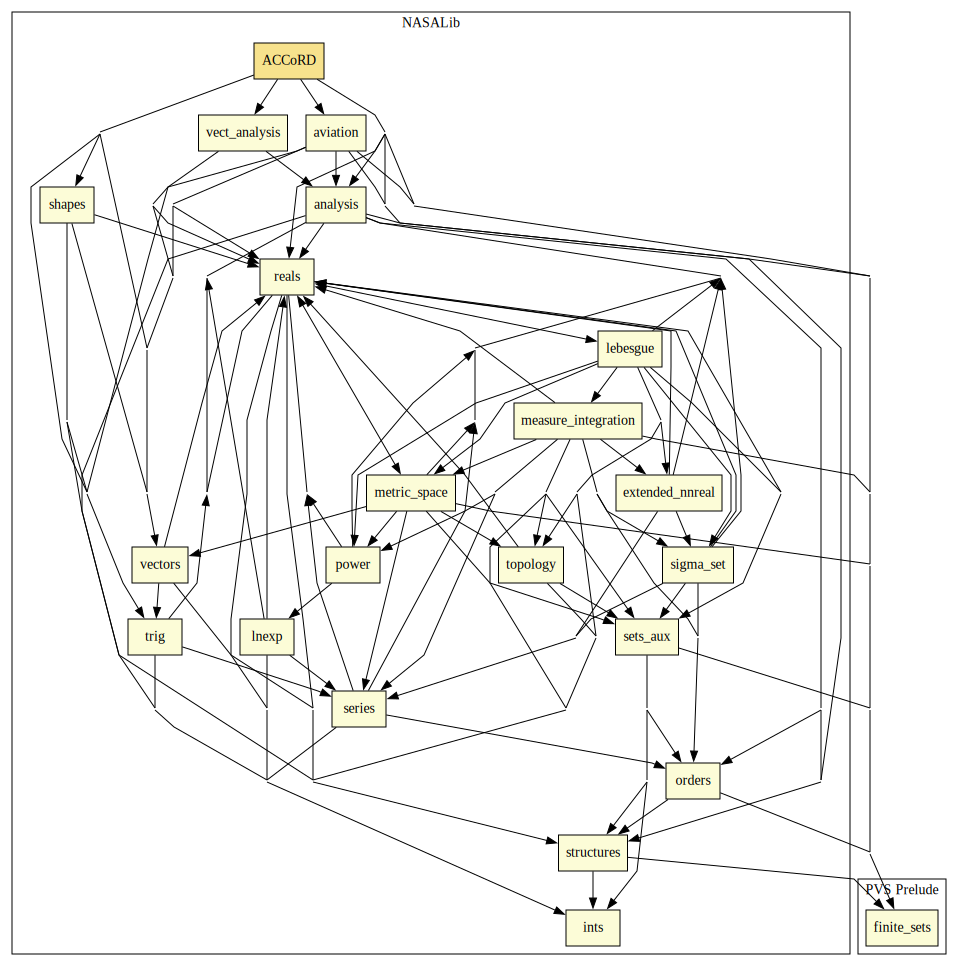

# ACCoRD

Airborne Coordinated Conflict Resolution and Detection (**ACCoRD**) is a framework for the formal specification and verification of state-based conflict detection and resolution algorithms. ACCoRD originates from KB3D, a state-based conflict detection and resolution algorithm. ACCoRD provides:

* A 3-D conflict detection algorithm, called CD3D, that is correct and complete.
* A 3-D conflict resolution algorithm, called CR3D, that is independent and coordinated for track only, ground speed only, vertical only, and combined track and ground speed resolution maneuvers.
* A loss of separation recovery algorithm that is correct.
* A 3-D prevention bands algorithm that computes all the critical vectors.
* Definition of provably correct safety buffers for CD&R algorithms (assuming that track and ground speed errors are unknown but bounded).

For details see: https://shemesh.larc.nasa.gov/fm/ACCoRD/

# Contributors
* Anthony Narkawicz, NASA, USA
* [César Muñoz](http://shemesh.larc.nasa.gov/people/cam), NASA, USA
* [Gilles Dowek](https://who.rocq.inria.fr/Gilles.Dowek/index-en.html), INRIA, France
* [George Hagen](https://shemesh.larc.nasa.gov/people/geh/), NASA, USA
* [Jeff Maddalon](https://shemesh.larc.nasa.gov/people/jmm/), NASA, USA
* [Ricky Butler](https://shemesh.larc.nasa.gov/people/rwb/), NASA, USA
* [Mariano Moscato](https://www.nianet.org/directory/research-staff/mariano-moscato/), NIA & NASA, USA
* [Sam Owre](http://www.csl.sri.com/users/owre), SRI, USA
* [Aaron Dutle](http://shemesh.larc.nasa.gov/people/amd), NASA, USA
* [Marco A. Feliú](https://www.nianet.org/directory/research-staff/marco-feliu/), NIA & NASA, USA

## Maintainer
* [César Muñoz](http://shemesh.larc.nasa.gov/people/cam), NASA, USA

# Dependencies

