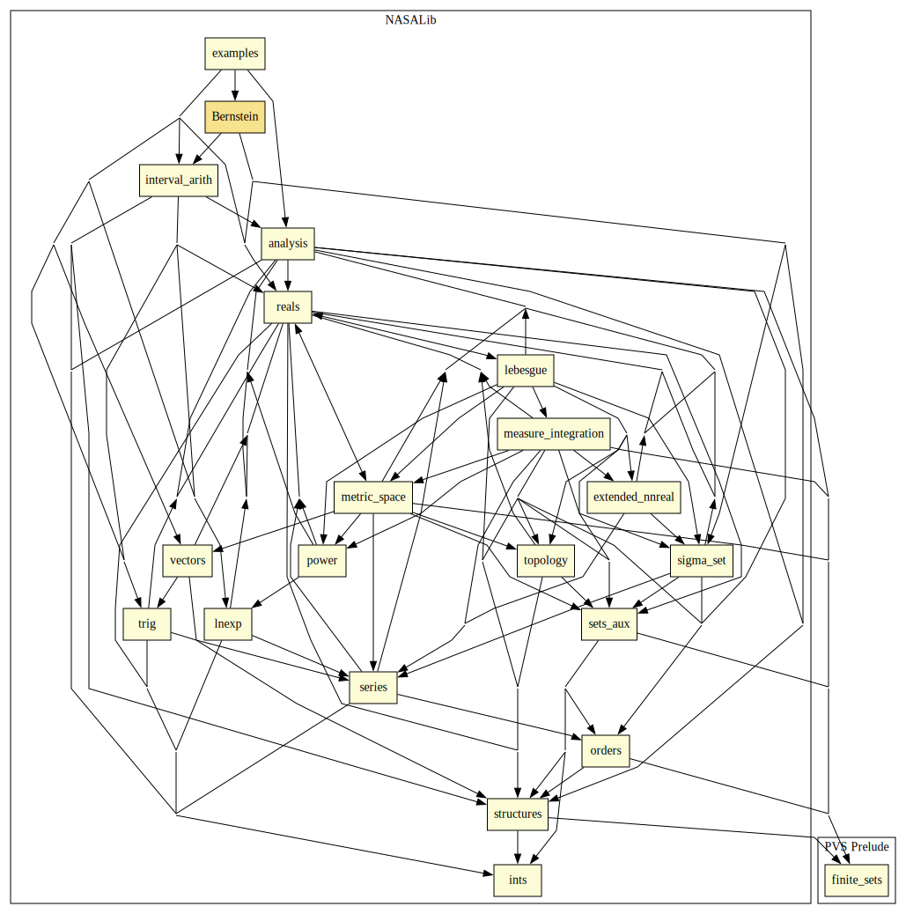

# Bernstein

This library provides a formalization of an efficient representation of multivariate Bernstein polynomials. 
It includes formally verified algorithms for finding lower and upper bounds of the minimum and maximum values of a polynomial. 
The algorithms are used in the definition of automated proof strategies for solving polynomial global optimization problems such as:
- Formally checking universally quantified multivariate polynomial inequalities on closed ranges.
- Finding witnesses that formally prove existentially quantified multivariate polynomial inequalities on open and closed ranges.
- Computing boxes (hyper-rectangles) that correctly under and over approximate regions defined as conjunction or disjunctions of multivariate polynomial inequalities.

## Highlights

### Major theorems

| Theorem | Location | PVS Name | Contributors |
| --- | --- | --- | --- |

### Strategies

### `bernstein`: Proves polynomial inequalities

#### Syntax

`(bernstein (&optional (fnum 1) vars (depth 100) vardir (equiv? t) (name "Pb__"))`

#### Description

Proves polynomial inequality `fnum` using Bernstein's basis on `vars` for `depth` levels of recursion.
The option `vardir` is an heuristic for selecting variables and direction when subdividing the range of the variables, e.g., `a2l__MaxVarMinDir`, `a2l__MaxVarMaxDir`, `a2l__AltVarLeftRight`, `a2l__AltVarRightLeft` (see theory in `Bernstein/vardirselector.pvs`).
If `vardir` is `nil`, an appropriate method is automatically selected. 
If `equiv?` is `nil`, the strategy does not try to prove the equivalence between the original polynomial and its Bernstein representation.

### Grizzly

The directory Grizzly contains a prototype client-server tool for solving global optimization problems.
Grizzly is a prototype client-server interface to PVS that solves global optimization problems such as finding min/max values of polynomials, formally verifying polynomial inequalities, solving satisfiability of polynomial inequalities, and computing under/over-approximations of regions defined by conjunction/disjunction/implication of polynomial inequalities.
For details see https://shemesh.larc.nasa.gov/people/cam/Bernstein/Grizzly.html.

### Examples

The following examples are automatically proved in PVS using the strategy (`bernstein`), which is included in the Bernstein library.
```
  FORALL (x,y:real):
      -0.5 <= x AND x <= 1 AND -2 <= y AND y <= 1 IMPLIES 
      4*x^2 - (21/10)*x^4 + (1/3)*x^6 + (x-3)*y - 4*y^2 + 4*y^4 > -3.4
  EXISTS (x,y:real):
      -0.5 <= x AND x <= 1 AND -2 <= y AND y <= 1 AND
      4*x^2 - (21/10)*x^4 + (1/3)*x^6 + (x-3)*y - 4*y^2 + 4*y^4 < -3.39
```

More challenging problems are also included in `Bernstein@examples`.

# Contributors
* Anthony Narkawicz, NASA, USA
* [César Muñoz](http://shemesh.larc.nasa.gov/people/cam), NASA, USA
* [Mariano Moscato](https://www.nianet.org/directory/research-staff/mariano-moscato/), NIA & NASA, USA
* [Marco A. Feliú](https://www.nianet.org/directory/research-staff/marco-feliu/), NIA & NASA, USA
* [Sam Owre](http://www.csl.sri.com/users/owre), SRI, USA

## Maintainer
* [César Muñoz](http://shemesh.larc.nasa.gov/people/cam), NASA, USA

# Dependencies


# References

- César Muñoz and Anthony Narkawicz, [Formalization of a Representation of Bernstein Polynomials and Applications to Global Optimization](https://shemesh.larc.nasa.gov/people/cam/publications/jar-mn-2012-draft.pdf), Journal of Automated Reasoning, Volume 51, Issue 2, pp. 151-196, August 2013. [BibTeX Reference](https://shemesh.larc.nasa.gov/people/cam/publications/JAR-MN-2013.bib).
- Anthony Narkawicz and César Muñoz, [Formal Verification of Conflict Detection Algorithms for Arbitrary Trajectories](http://interval.louisiana.edu/reliable-computing-journal/volume-17/reliable-computing-17-pp-209-237.pdf), Reliable Computing, Volume 17*, pp. 209-237, December, 2012. [BibTeX Reference](https://shemesh.larc.nasa.gov/people/cam/publications/RC-NM-2012.bib).
- Luis Crespo, César Muñoz, Anthony Narkawicz, Sean Kenny, and Daniel Giesy, [Uncertainty Analysis via Failure Domain Characterization: Polynomial Requirement Functions](https://shemesh.larc.nasa.gov/people/cam/publications/ESREL2011.pdf), European Safety and Reliability Conference, September, 2011. [BibTeX Reference](https://shemesh.larc.nasa.gov/people/cam/publications/ESREL2011.bib).
