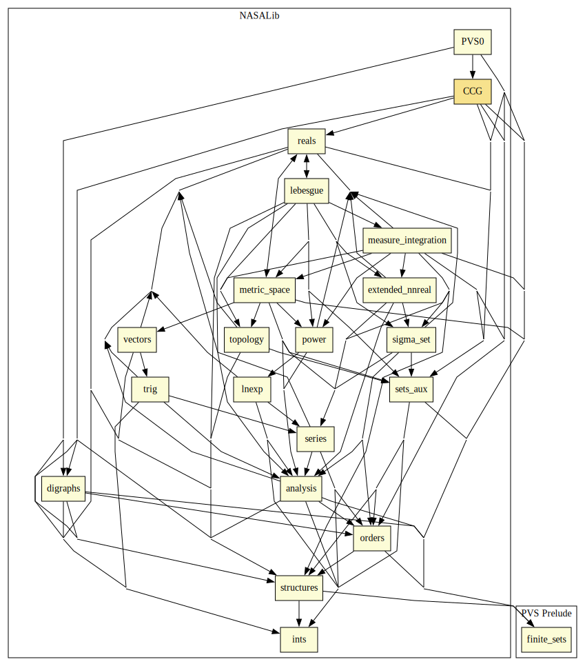

# CCG

This library contains formalizations of different termination criteria, such as: Calling Context Graph and Size Change Principle.

## Highlights

### Major theorems

| Theorem | Location | PVS Name | Contributors |
| --- | --- | --- | --- |

# Contributors
* Andreia Avelar Borges, University of Brasilia, Brazil
* [Mauricio Ayala-Rincón](http://www.mat.unb.br/~ayala), University of Brasilia, Brazil
* [Mariano Moscato](https://www.nianet.org/directory/research-staff/mariano-moscato/), NIA & NASA, USA
* [César Muñoz](http://shemesh.larc.nasa.gov/people/cam), NASA, USA
* Anthony Narkawicz, NASA, USA
* [Aaron Dutle](http://shemesh.larc.nasa.gov/people/amd), NASA, USA
* [Sam Owre](http://www.csl.sri.com/users/owre), SRI, USA

## Maintainer
* [Mariano Moscato](https://www.nianet.org/directory/research-staff/mariano-moscato/), NIA & NASA, USA

# Dependencies

