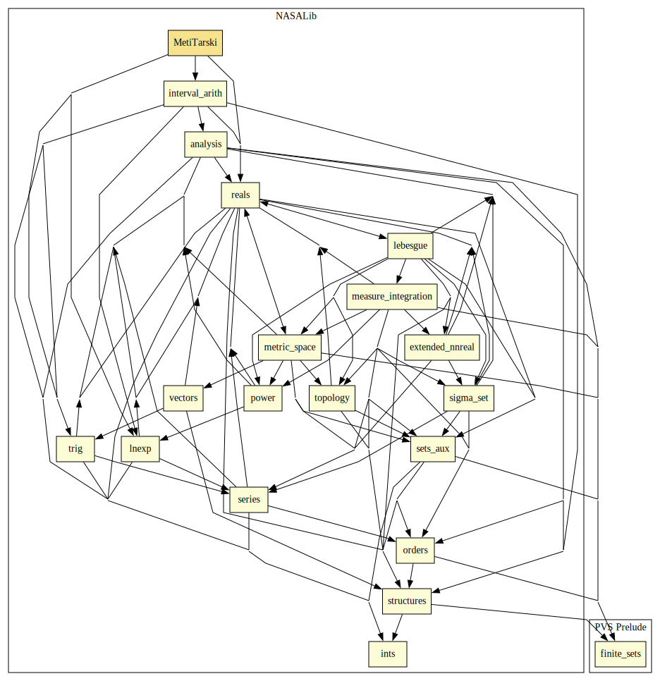

# MetiTarski

## Highlights

### Proof Commands

#### Syntax

`(metit (&optional (fnums 1) (timeout 60) verbose? options (pre-bins? t) arch about?))`

#### Description

Calls the MetiTarski prover on first order formulas `fnums?`. 
The `timeout` parameter is a processor time limit (in seconds). 
Output information generated by MetiTarski is printed when `verbose?` is set to t. 
Additional options to MetiTarski can be provided through `options`.

Executables of MetiTarski and z3 are pre-installed in the NASALib. 
These binaries are always tried when `pre-bins?` is set to `t` (default value).
If `pre-bins?` is set to `nil`, the strategy tries to use the versions of MetiTarski and z3 installed in the system. 
The option `arch` forces the strategy to use the pre-installed version for a given architecture.
If `about?` is set to `t`, the strategy prints information about MetiTarski, z3, and their pre-installed versions.

MetiTarski requires an external algebraic decision method (EADM).
The default EADM is z3.
However, other EADM are also supported, e.g., QEP and Mathematica. 
See MetiTarski's documentation for information about using a different EADM.

The files `METIT-LICENSE.txt` and `Z3-LICENSE.txt` in `NASALib/MetiTarski/dist` contains MetiTarski's and z3's license of use, respectively.

# Contributors
* [César Muñoz](http://shemesh.larc.nasa.gov/people/cam), NASA, USA
* [Sam Owre](http://www.csl.sri.com/users/owre), SRI, USA
* [Mariano Moscato](https://www.nianet.org/directory/research-staff/mariano-moscato/), NIA & NASA, USA

## Maintainer
* [César Muñoz](http://shemesh.larc.nasa.gov/people/cam), NASA, USA

# Dependencies

