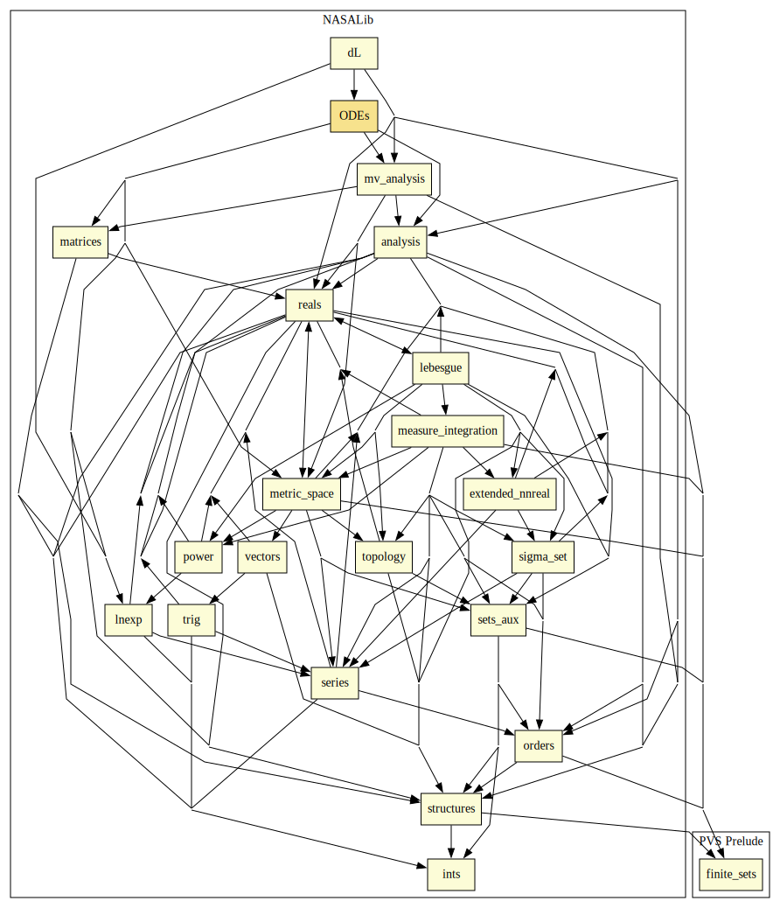
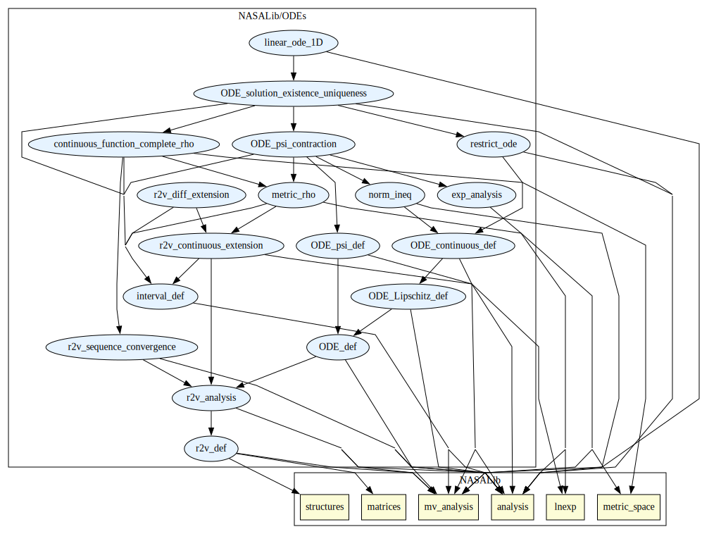

# Ordinary Differential Equations

Basics of Ordinary Differential Equations

## Highlights

### Major theorems

| Theorem | Location | PVS Name | Contributors |
| --- | --- | --- | --- |
|Picard-Lindelöf Theorem|`ODEs@ODE_solution_existence_uniqueness`|`unique_solution`| J Tanner Slagel |

# Contributors
* J Tanner Slagel, NASA, USA
* [Aaron Dutle](http://shemesh.larc.nasa.gov/people/amd), NASA, USA

## Maintainer
* J Tanner Slagel, NASA, USA, <j.tanner.slagel@nasa.gov>

# Dependencies

