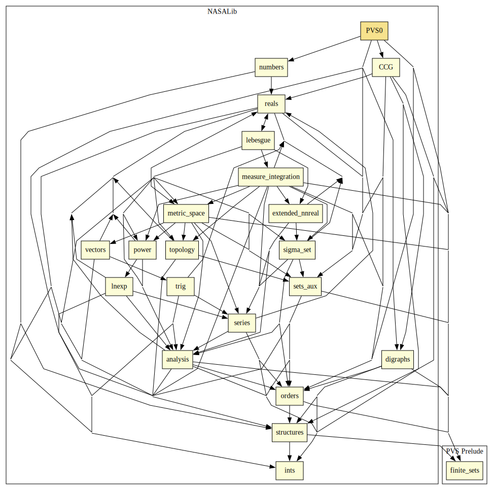

# PVS0

This library provides a formalization of fundamental computability concepts, such as termination.
The results are expressed on a simple functional language called `PVS0`.

## Highlights

### Major theorems

| Theorem | Location | PVS Name | Contributors |
| --- | --- | --- | --- |

# Contributors
* [César Muñoz](http://shemesh.larc.nasa.gov/people/cam), NASA, USA
* Andreia Avelar Borges, University of Brasilia, Brazil
* [Mauricio Ayala-Rincón](http://www.mat.unb.br/~ayala), University of Brasilia, Brazil
* Ariane Alves Almeida, University of Brasilia, Brazil
* Thiago Mendonça Ferreira Ramos, University of Brasilia, Brazil
* [Mariano Moscato](https://www.nianet.org/directory/research-staff/mariano-moscato/), NIA & NASA, USA
* [Sam Owre](http://www.csl.sri.com/users/owre), SRI, USA

## Maintainer
* [César Muñoz](http://shemesh.larc.nasa.gov/people/cam), NASA, USA

# Dependencies

