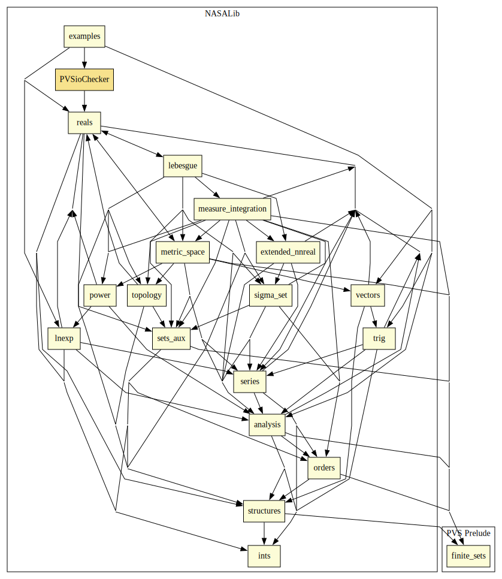

# Animation

This library provides functionalities to facilitate and automate the animation of PVS specifications.

## Highlights

# Contributors
* [César Muñoz](http://shemesh.larc.nasa.gov/people/cam), NASA, USA
* [Mariano Moscato](https://www.nianet.org/directory/research-staff/mariano-moscato/), NIA & NASA, USA
* [Sam Owre](http://www.csl.sri.com/users/owre), SRI, USA

## Maintainer
* [César Muñoz](http://shemesh.larc.nasa.gov/people/cam), NASA, USA

# Dependencies

