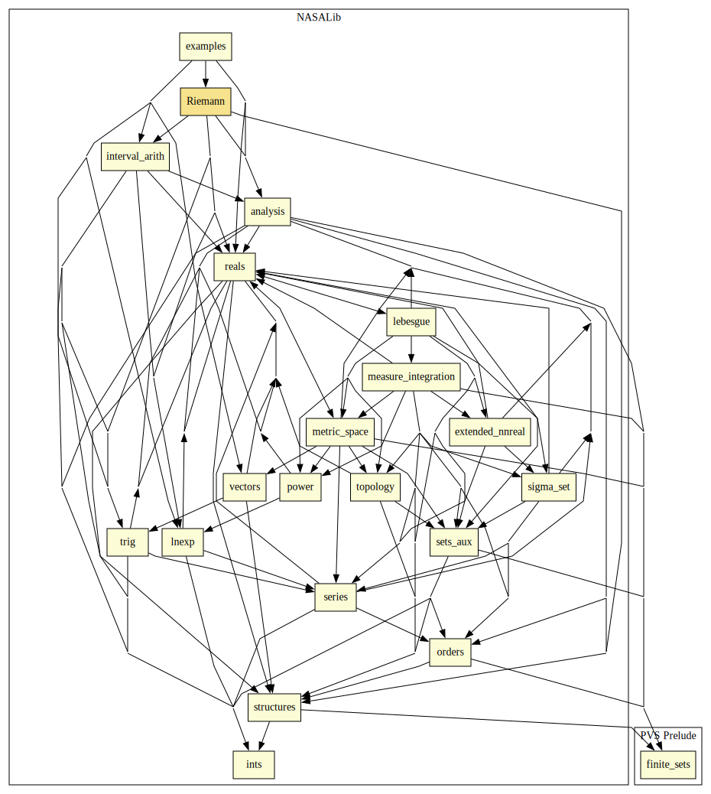

# Riemann integral

This library provides a formalization of the Riemann definition of the integral of a function on an given interval.

## Highlights

### Major theorems

| Theorem | Location | PVS Name | Contributors |
| --- | --- | --- | --- |

### Proof Commands

#### Syntax

`(riemann-numerical (&optional (breaks 12) (precision 2))`

#### Description

If the sequent contains un expression of form `integral(A, B, EXPR)`, the strategy computes an interval containing the value of the integral of `EXPR` over the interval `[A,B]`. 
The parameter `precision` is used to determine the size of the output interval and `breaks` indicates the number of regions to use in the Riemann sum. 
In particular, the sum will use `2^breaks` regions.

# Contributors
* [César Muñoz](http://shemesh.larc.nasa.gov/people/cam), NASA, USA
* Amer Tahat, Michigan Technological University, USA
* Gregory Anderson, University of Texas at Austin, USA
* [Mariano Moscato](https://www.nianet.org/directory/research-staff/mariano-moscato/), NIA & NASA, USA
* [Sam Owre](http://www.csl.sri.com/users/owre), SRI, USA

## Maintainer
* [César Muñoz](http://shemesh.larc.nasa.gov/people/cam), NASA, USA

# Dependencies

