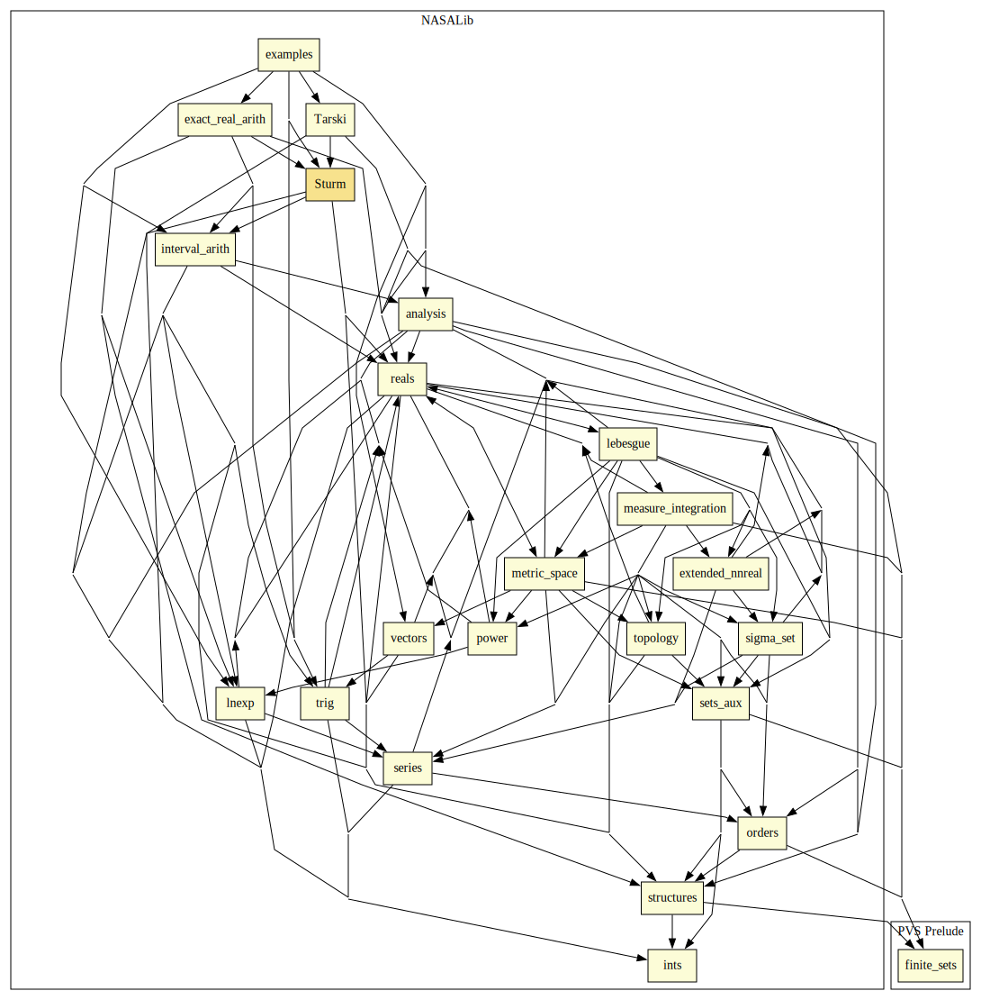

# Sturm

Sturm's Theorem is a well-known result in real algebraic geometry that provides a function that computes the number of roots of a univariate polynomial in a semi-open interval. 
This library includes a formalization of Sturm's Theorem, as well as a decision procedure that determines the sign of a univariate polynomial on a given interval.
The decision procedure uses a combination of Sturm's Theorem, an interval bisection procedure, and the fact that a polynomial with exactly one root in a finite interval is always nonnegative on that interval if and only if it is nonnegative at both endpoints. 
It is formally verified in PVS that the decision procedure is sound and complete.
This result is a the basis of the proof-producing strategies `sturm` and `mono-poly` for reasoning about polynomial relations over a real interval. 
The soundness of the strategies depends solely on the internal logic of PVS rather than on an external oracle.

## Highlights

### Major theorems

| Theorem | Location | PVS Name | Contributors |
| --- | --- | --- | --- |
|Sturm's Theorem |`Sturm@sturm`|`sturm`| Anthony Narkawicz |

## Strategies

### `sturm`: Decision procedure for single variable polynomials

#### Syntax

`(sturm (&optional (fnum 1) (preds? t) dont-fail?))`

#### Description

Applies decision procedure for single variable polynomials based on Sturm's Theorem to formula `fnum`. 
Type predicates are introduced as hypotheses when `preds?` is t. 
If `dont-fail?` is set to t, strategy skips instead of failing when sequent cannot be discharged.

### `mono-poly`: Proving polynomial monotonicity

#### Syntax

`(mono-poly (&optional (fnum 1) (preds? t) dont-fail?))`

#### Description

Applies decision procedure for polynomial monotonicity based on Sturm's Theorem to formula `fnum`. 
Type predicates are introduced as hypotheses when `preds?` is t. 
If `dont-fail?` is set to t, strategy skips instead of failing when sequent cannot be discharged.

## Examples

See examples of use in `examples@sturm_examples`.

# Contributors
* Anthony Narkawicz, NASA, USA
* [César Muñoz](http://shemesh.larc.nasa.gov/people/cam), NASA, USA
* [Aaron Dutle](http://shemesh.larc.nasa.gov/people/amd), NASA, USA
* [Mariano Moscato](https://www.nianet.org/directory/research-staff/mariano-moscato/), NIA & NASA, USA
* [Sam Owre](http://www.csl.sri.com/users/owre), SRI, USA

## Maintainer
* [César Muñoz](http://shemesh.larc.nasa.gov/people/cam), NASA, USA

# Dependencies

