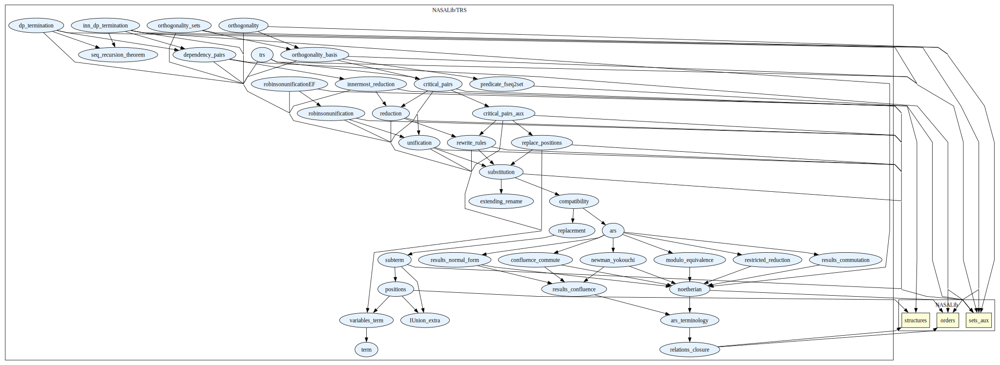

# TRS

Term rewrite systems and Robinson unification algorithm.

## Highlights

### Major theorems

| Theorem | Location | PVS Name | Contributors |
| --- | --- | --- | --- |
|Knuth-Bendix Critical Pair Theorem|`TRS@critical_pairs`|`CP_Theorem`| André Galdino, Mauricio Ayala-Rincón |
|Newman Lemma |`TRS@newman_yokouchi`|`Newman_lemma`| André Galdino, Mauricio Ayala-Rincón |
|Yokouchi Lemma |`TRS@newman_yokouchi`|`Yokouchi_lemma`| André Galdino, Mauricio Ayala-Rincón |
|Confluence of Orthogonal TRSs|`TRS@orthogonality`|`Orthogonal_implies_confluent`| Ana Cristina Rocha Oliveira, Mauricio Ayala-Rincón |
|Church-Rosser Theorem |`TRS@results_confluence`|`CR_iff_Confluent`| André Galdino, Mauricio Ayala-Rincón |
|Robinson Unification |`TRS@robinsonunification`|`completeness_robinson_unification_algorithm`| Andreia Avelar Borges, Mauricio Ayala-Rincón |
|Dependency Pairs Termination | `dp_termination`|`dp_termination_implies_noetherian` | Ariane Alves Almeida, Mauricio Ayala-Rincón
|Innermost Dependency Pairs Termination | `inn_dp_termination`|`inn_dp_termination_noetherian` | Ariane Alves Almeida, Mauricio Ayala-Rincón

# Contributors
* Andreia Avelar Borges, University of Brasilia, Brazil
* André Galdino, Federal University of Goiás, Brazil
* Ana Cristina Rocha Oliveira, University of Brasilia, Brazil
* [Mauricio Ayala-Rincón](http://www.mat.unb.br/~ayala), University of Brasilia, Brazil
* Ariane Alves Almeida, University of Brasilia, Brazil
* Thiago Mendonça Ferreira Ramos, University of Brasilia, Brazil
* [César Muñoz](http://shemesh.larc.nasa.gov/people/cam), NASA, USA
* [Mariano Moscato](https://www.nianet.org/directory/research-staff/mariano-moscato/), NIA & NASA, USA
* [Sam Owre](http://www.csl.sri.com/users/owre), SRI, USA

## Maintainer
* [César Muñoz](http://shemesh.larc.nasa.gov/people/cam), NASA, USA

# Dependencies

# References
 
* A.A. Almeida, and M. Ayala-Rincón. Formalizing the Dependency Pairs Criterion for Innermost Termination. Science of Computer Programming 195:102474, [doi](https://doi.org/10.1016/j.scico.2020.102474) 2020.

* A. C. Rocha-Oliveira, A. L. Galdino and M. Ayala-Rincón. Confluence of Orthogonal Term Rewriting Systems in the Prototype Verification System. Journal of Automated Reasoning, Pages 1-21, [doi](https://doi.org/10.1007/s10817-016-9376-2), 2016.

* A. B. Avelar, A. L. Galdino, F. L. C. de Moura, and M. Ayala-Rincón. First-order unification in the PVS proof assistant. Logic Journal of the IGPL, Volume 22(5), Pages 758-789, [doi](https://doi.org/10.1093/jigpal/jzu012) 2014.

* A.L. Galdino and M. Ayala-Rincón. A Formalization of the Knuth-Bendix(-Huet) Critical Pair Theorem. Journal of Automated Reasoning, [doi](https://doi.org/10.1007/s10817-010-9165-2) 2010.

* A.L. Galdino and M. Ayala-Rincón. A Formalization of Newman's and Yokouchi Lemmas in a Higher-Order Language, Journal of Formalized Reasoning, 1(1):39-50, [doi](https://doi.org/10.6092/issn.1972-5787/1347),  2008. 