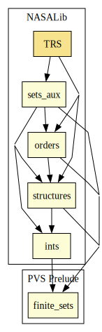

# TRS

Term rewrite systems and Robinson unification algorithm.

## Highlights

### Major theorems

| Theorem | Location | PVS Name | Contributors |
| --- | --- | --- | --- |
|Knuth-Bendix Critical Pair Theorem|`TRS@critical_pairs`|`CP_Theorem`| André Galdino, Mauricio Ayala-Rincón |
|Newman Lemma |`TRS@newman_yokouchi`|`Newman_lemma`| André Galdino, Mauricio Ayala-Rincón |
|Yokouchi Lemma |`TRS@newman_yokouchi`|`Yokouchi_lemma`| André Galdino, Mauricio Ayala-Rincón |
|Confluence of Orthogonal TRSs|`TRS@orthogonality`|`Orthogonal_implies_confluent`| Ana Cristina Rocha Oliveira, Mauricio Ayala-Rincón |
|Church-Rosser Theorem |`TRS@results_confluence`|`CR_iff_Confluent`| André Galdino, Mauricio Ayala-Rincón |
|Robinson Unification |`TRS@robinsonunification`|`completeness_robinson_unification_algorithm`| Andreia Avelar Borges, Mauricio Ayala-Rincón |

# Contributors
* Andreia Avelar Borges, University of Brasilia, Brazil
* André Galdino, Federal University of Goiás, Brazil
* Ana Cristina Rocha Oliveira, University of Brasilia, Brazil
* [Mauricio Ayala-Rincón](http://www.mat.unb.br/~ayala), University of Brasilia, Brazil
* Ariane Alves Almeida, University of Brasilia, Brazil
* Thiago Mendonça Ferreira Ramos, University of Brasilia, Brazil
* [César Muñoz](http://shemesh.larc.nasa.gov/people/cam), NASA, USA
* [Mariano Moscato](https://www.nianet.org/directory/research-staff/mariano-moscato/), NIA & NASA, USA
* [Sam Owre](http://www.csl.sri.com/users/owre), SRI, USA

## Maintainer
* [César Muñoz](http://shemesh.larc.nasa.gov/people/cam), NASA, USA

# Dependencies

