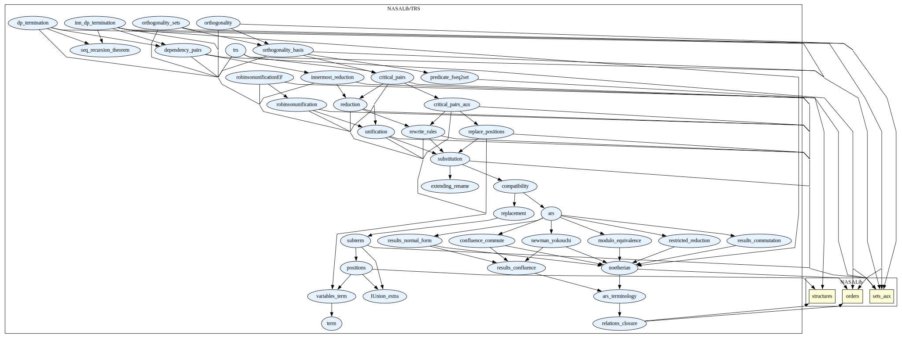
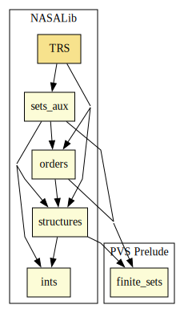

# TRS

Term rewrite systems, abstract reduciton systems, Robinson unification
algorithm, and anti-unification.

## Highlights

### ARS theories
-----------------

* `relations_closure.pvs`        This theory contains the definitions of closure 
                             of a relation and some properties.

* `ars_terminology.pvs`          This theory contains some terminology of ARS such 
                             as unique normal form, reducible and sucessor, and 
                             notions of confluence and commutation.

* `results_confluence.pvs`     This theory contains some results about confluence
                             such as strong confluent implies semi-confluent.

* `results_commutation.pvs`     This theory contains some results about commutation
                             such as Commutation lemma.

* `results_normal_form.pvs`      This theory contains some results involving normal
                             form such as a relation is normalizing and
                             confluent iff every element has a unique 
                             normal form.

* `noetherian.pvs`               This theory contains the definition of convergent
                             reduction and noetherian relation and the
                             Noetherian induction lemma.

* `newman_yokouchi.pvs`          This theory contains the specification of Newman's
                             lemma and Yokouchi's lemma

* `modulo_equivalence.pvs`       This theory contains specifications about Reduction 
                             modulo equivalence such as local confluence, confluence
                             and Church-Rosser property modulo equivalence, and some 
                             properties such as the general Newman's lemma.

* `confluence_commute.pvs`       This theory contains some results and exercises from 
                             the book TeReSe.

### TRS theories
-----------------

* `arity.pvs`                    This theory contains the definition of the function
                             arity.

* `term.pvs`                     This theory contain the definition of an abstract term 
                             structure.

* `variables_term.pvs`           This theory contain the definition of a variable set V.

* `term_adt.pvs`                 This theory is automatically generated by the 
                             specification of a term (term.pvs`) and contains 
                             extensionality axioms, eta axiom, induction scheme and 
                             a well-foundedness axiom.

* `positions.pvs`                This theory contains the definitons of the set of 
                             positions of a term, parallel positions among other, 
                             and some properties of positions.

* `subterm.pvs`                  This theory contains the notions of subterm of a term, 
                             and variables occurring in a term, and some properties.

* `replacement.pvs`              This theory contains the definition of replacing the 
                             subterm at some position by a term, and some properties.

* `compatibility.pvs`            This theory contains the definitions of closed under 
                             substitutions and operations, and compatible with 
                             operations and contexts, and some properties such as 
                             compatible with operations iff compatible with contexts.

* `substitution.pvs`             This theory contains the definitions of substitution, 
                             domain and range of a substitution, restriction and 
                             extension of a substitution, composition of two 
                             substitutions, and a most general unifier, 
                             and some properties.

* `extending_rename.pvs`         This theory contain the definition that extend a rename
                             from a given domain to the same type as identity.

* `rewrite_rules.pvs`            This theory contains the definitions of a rewrite rule
                             and a set (type) of rewrite rules.

* `reduction.pvs`                This theory contains the definition of reduction 
                             relations (at some position and restricted to non-root position) 
                             and some properties such as closed under 
                             substitutions and compatible with operations.

* `replace_positions.pvs`        This theory contains the notion of substitutes all
                             subterms at a sequence of parallel positions of a term
                             by another term, and some properties.
                               
* `unification.pvs`              This theory is composed of a set of specifications and 
                             formalization of definitions and lemmas which allowed us
                             to formalize the lemma which guarantee the existence of
                             a most general unifier on set first-order terms.

* `robinsonunification.pvs`      This theory contains the formalization of a greedy
                             first-order unification algorithm a la Robinson.
                               
* `robinsonunificationEF.pvs`    This theory contains the formalization of a more
                             efficient first-order unification algorithm a la
                             Robinson.

* `critical_pairs_aux.pvs`       This theory contains definitions and properties needful
                             to prove the Critical Pairs Theorem.

* `critical_pairs.pvs`           This theory contains the definition of a Critical Pairs
                             and the Critical Pairs Theorem.

* `orthogonality_basis.pvs`      This theory contains specification of notions related
                             to orthogonal rewriting systems, parallel rewriting, the
                             formalization of confluence of left and right linear
                             non-ambiguous TRSs and the Parallel Moves Lemma.

* `orthogonality_sets.pvs`       This theory contains the proof of the Theorem of
                             confluence of orthogonal TRSs. The inductive proof of
                             the main theorem uses the Parallel Moves Lemma. In this
                             version, sequences (of rules, variables, terms,
                             substitutions) involved in one-step parallel rewritings
                             and parallel forks, are translated into sets in order to 
                             avoid direct treatment of these sequences, using instead 
                             simpler set properties.

* `orthogonality.pvs`            This theory also contains the proof of the Theorem of
                             confluence of orthogonal TRSs. The inductive proof of
                             the main theorem uses the Parallel Moves Lemma. Some
                             operators over sequences of positions are used and,
                             differently from the theory orthogonality_sets, no
                             advantage of properties over sets is exploited.

* `predicate_fseq2set.pvs`       This theory states several properties of finite
                             sequences over a non interpreted type T converted in
                             sets through the PVS prelude conversions "seq2set" and
                             "set2seq". 

* `IUnion_extra.pvs`             This theory contains additional properties about
                             disjoint sets operations and finite union of a finite
                             family of finite sets.

* `seq_recursion_theorem.pvs`	     This theory contains a version of the recursion theorem 
                             for set theory, allowing the construction of functions 
                             over the naturals to elements of a non-empty set/predicate 
                             for which there exists a function over elements of such
                             set/predicate. This result is used to build infinite
                             chains of Dependency Pairs from a minimal non-terminating
                             term.  Despite its application it is a general set theoretical
                             result.

* `restricted_reduction.pvs`         This theory contains a definition allowing to restrict a given 
                             relation to the descendants of a given element. It also contains
                             results for Noetherianity of such relations. Also used in the 
                             Dependency Pairs Theory.  

* `innermost_reduction          This theory contains the definition of innermost reduction 
                             relations (at some position and restricted to non-root position) 
                             and some properties such as closed under 
                             substitutions and compatible with operations.

* `dependency_pairs.pvs`             This theory contains the specification of the basic elements  
                             used by the Dependency Pairs termination criterion. It also  
                             contains functions and predicates allowing the formalization  
                             of correction of the Dependency Pairs termination criterion.

* `dp_termination.pvs`               This theory contains the formalization of the correction of the 
                             Dependency Pairs termination criterion (for arbitrary reductions).

* `inn_dp_termination.pvs`           This theory contains the formalization of the correction of the 
                             Innermost Dependency Pairs termination criterion.

### Anti-Unification

Anti-unification is the problem of detecting commonalities between
terms.  For more details, see [anti-unification](./README_antiunification.md).

### Major theorems

| Theorem | Location | PVS Name | Contributors |
| --- | --- | --- | --- |
|Knuth-Bendix Critical Pair Theorem|`TRS@critical_pairs`|`CP_Theorem`| André Galdino, Mauricio Ayala-Rincón |
|Newman Lemma |`TRS@newman_yokouchi`|`Newman_lemma`| André Galdino, Mauricio Ayala-Rincón |
|Yokouchi Lemma |`TRS@newman_yokouchi`|`Yokouchi_lemma`| André Galdino, Mauricio Ayala-Rincón |
|Confluence of Orthogonal TRSs|`TRS@orthogonality`|`Orthogonal_implies_confluent`| Ana Cristina Rocha Oliveira, Mauricio Ayala-Rincón |
|Church-Rosser Theorem |`TRS@results_confluence`|`CR_iff_Confluent`| André Galdino, Mauricio Ayala-Rincón |
|Robinson Unification |`TRS@robinsonunification`|`completeness_robinson_unification_algorithm`| Andreia Avelar Borges, Mauricio Ayala-Rincón |
|Dependency Pairs Termination | `dp_termination`|`dp_termination_implies_noetherian` | Ariane Alves Almeida, Mauricio Ayala-Rincón
|Innermost Dependency Pairs Termination | `inn_dp_termination`|`inn_dp_termination_noetherian` | Ariane Alves Almeida, Mauricio Ayala-Rincón

# Contributors
* Andreia Avelar Borges, University of Brasilia, Brazil
* André Galdino, Federal University of Goiás, Brazil
* Ana Cristina Rocha Oliveira, University of Brasilia, Brazil
* [Mauricio Ayala-Rincón](http://www.mat.unb.br/~ayala), University of Brasilia, Brazil
* Ariane Alves Almeida, University of Brasilia, Brazil
* Thiago Mendonça Ferreira Ramos, University of Brasilia, Brazil
* [César Muñoz](http://shemesh.larc.nasa.gov/people/cam), NASA, USA
* Mariano Moscato, NIA & NASA, USA
* [Sam Owre](http://www.csl.sri.com/users/owre), SRI, USA

## Maintainer
* [César Muñoz](http://shemesh.larc.nasa.gov/people/cam), NASA, USA

# Dependencies

# References
 
* A.A. Almeida, and M. Ayala-Rincón. Formalizing the Dependency Pairs Criterion for Innermost Termination. Science of Computer Programming 195:102474, [doi](https://doi.org/10.1016/j.scico.2020.102474) 2020.

* A. C. Rocha-Oliveira, A. L. Galdino and M. Ayala-Rincón. Confluence of Orthogonal Term Rewriting Systems in the Prototype Verification System. Journal of Automated Reasoning, Pages 1-21, [doi](https://doi.org/10.1007/s10817-016-9376-2), 2016.

* A. B. Avelar, A. L. Galdino, F. L. C. de Moura, and M. Ayala-Rincón. First-order unification in the PVS proof assistant. Logic Journal of the IGPL, Volume 22(5), Pages 758-789, [doi](https://doi.org/10.1093/jigpal/jzu012) 2014.

* A.L. Galdino and M. Ayala-Rincón. A Formalization of the Knuth-Bendix(-Huet) Critical Pair Theorem. Journal of Automated Reasoning, [doi](https://doi.org/10.1007/s10817-010-9165-2) 2010.

* A.L. Galdino and M. Ayala-Rincón. A Formalization of Newman's and Yokouchi Lemmas in a Higher-Order Language, Journal of Formalized Reasoning, 1(1):39-50, [doi](https://doi.org/10.6092/issn.1972-5787/1347),  2008. 
