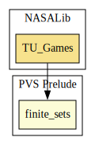

# Cooperative TU-games

A formal theory of cooperative TU-games.

This work has been done at the University of Perpignan within the Master's Thesis, under the supervision of Marc Daumas and Annick Truffert, with the help of Michel Ventou.

Presented at the 6th conference on Modeling Decisions for Artificial Intelligence (MDAI 2009 in Awaji Island, Japan) and a report appears in Volume 5861/2009 of the Lecture Notes in Computer Science (Springer).
A Formal Theory of Cooperative TU-Games, DOI 10.1007/978-3-642-04820-3_8, Pages 81-91.

## Highlights

### Major theorems

| Theorem | Location | PVS Name | Contributors |
| --- | --- | --- | --- |

# Contributors
* [Érik Martin-Dorel](http://erik.martin-dorel.org/), U. Montpellier 2 & U. of Perpignan (formerly), France
* [César Muñoz](http://shemesh.larc.nasa.gov/people/cam), NASA, USA
* [Sam Owre](http://www.csl.sri.com/users/owre), SRI, USA
* [Mariano Moscato](https://www.nianet.org/directory/research-staff/mariano-moscato/), NIA & NASA, USA

## Maintainer
* [César Muñoz](http://shemesh.larc.nasa.gov/people/cam), NASA, USA

# Dependencies

