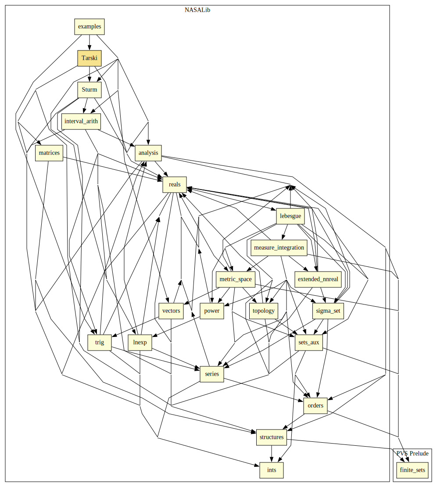

# Tarski

Tarski's Theorem is a generalization of Sturm's theorem that provides a linear relationship between functions known as Tarski queries and cardinalities of certain sets.
The linear system that results from this relationship is in fact invertible and can be used to explicitly count the number of roots of a univariate polynomial on a set defined by a system of polynomial relations. 
This computation is used to define a computable function that calculates whether any system of univariate polynomials is satisfiable. 
This library includes a formalization of Tarski's Theorem, as well as a decision procedure that determines the satisfiability of a system of univariate polynomial relations over the real line. 
It is formally verified in PVS that the decision procedure is sound and complete. 
This result is a the basis of the proof-producing strategy `tarski` for reasoning about systems of univariate polynomial relations on the real line. 
The soundness of the strategy depends solely on the internal logic of PVS rather than on an external oracle.

## Highlights

### Major theorems

| Theorem | Location | PVS Name | Contributors |
| --- | --- | --- | --- |
|Tarski's Theorem |`Tarski@sturmtarski`|`sturm_tarski_unbounded`| Anthony Narkawicz, Aaron Dutle |

## Strategies

### `tarski`: Decision procedure for univariate polynomials

#### Syntax

`(tarski (&optional (fnums *) var (preds? t) dont-fail? timing? old?))`

#### Description

Applies decision procedure for univariate polynomial based on Tarski's Theorem to formulas in `fnum?`.
Each formula denoted by `fnum?` is expected to have the form `pi Ri qi`, where `pi` and `qi` are polynomials on the variable `var` and `Ri` is a relation in {`<`,`<=`,`>`,`>=`,`=`,`/=`}.
If `fnum?` denotes a simply quantified formula, that formula is expected to have one of the forms 
- `EXISTS (var:real) : p0 R0 q0 AND ... AND pn Rn qn` 
- `FORALL (var:real) : p0 R0 q0 AND ... AND pi Ri qi IMPLIES pj Rj qj OR ... OR pn Rn qn`.
If variable `var` is not provided, it is inferred by the strategy from the formulas in `fnum?`.

The strategy ignores sub-expressions that are not polynomial relations when the validity of the formula without these sub-expressions implies the validity of the original formula.

By default, the subtype predicate of `var` is introduced as hypothesis. This behavior can be disabled by setting `preds?` to nil.

When `dont-fail?` is set to t, strategy skips instead of failing when sequent cannot be discharged.

When `timing?` is set to t, strategy prints timing information of the ground evaluation of the formally verified PVS algorithm.

## Examples

See examples of use in `examples@tarski_examples`.

# Contributors
* Anthony Narkawicz, NASA, USA
* [César Muñoz](http://shemesh.larc.nasa.gov/people/cam), NASA, USA
* [Aaron Dutle](http://shemesh.larc.nasa.gov/people/amd), NASA, USA
* Katherine Cordwell, CMU, USA
* [Mariano Moscato](https://www.nianet.org/directory/research-staff/mariano-moscato/), NIA & NASA, USA
* [Sam Owre](http://www.csl.sri.com/users/owre), SRI, USA

## Maintainer
* [César Muñoz](http://shemesh.larc.nasa.gov/people/cam), NASA, USA

# Dependencies

