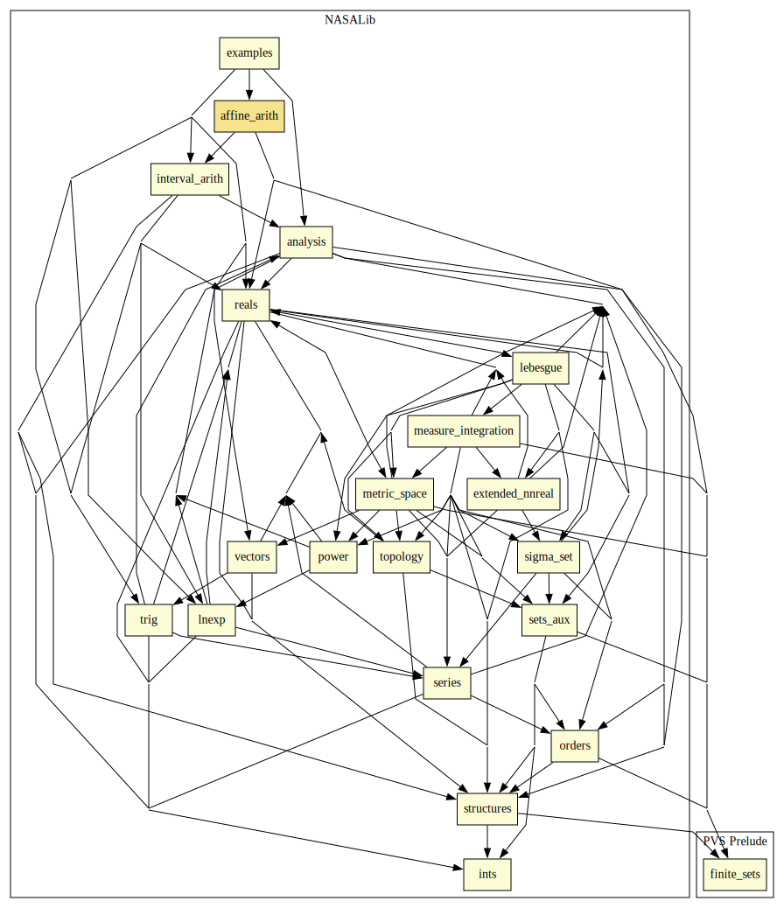

# Affine Arithmetic

This library formalizes the theory of affine arithmetic for expressions involving constants, variables, addition, subtraction, multiplication, and the power operation on variables. 
This development includes the proof-producing strategies `aa-numerical` and `affine` for evaluating multivariate polynomials with variables in interval domains.

## Highlights

## Major theorems

| Theorem | Location | PVS Name | Contributors |
| --- | --- | --- | --- |
| Inclusion Theorem of Affine Arithmetic | `affine_arith@affine_expr_Eval` | `EvalwCache_inclusion` | Mariano Moscato |

## Strategies

### `aa-numerical`: Computing bounds for a real-valued expression

#### Syntax

`(aa-numerical expr &optional (precision 3) (maxdepth 10) min? max? vars subs dirvar verbose? label (equiv? t)))`

#### Description

Computes lower and upper bounds of the minimum and
maximum values of `expr` using a branch and bound algorithm based on
affine arithmetic. 

* The parameter `precision` indicates an accuracy of 10^-`precision` in every atomic computation. However, this accuracy is not guaranteed in the final result. 
* A bound on the recursion depth for the branch and bound algorithm can be set trough the parameter `maxdepth`.
* For efficiency, the `min?` and `max?` options can be used to restrict the precision of the computations to either the lower or upper bound, respectively.
* The parameter `vars` is a list of the form `(<v1> ... <vn>)`, where each `<vi>` is either a variable name, e.g., `"x"`, or a list consisting of a variable name and an interval, e.g., `("x" "[|-1/3,1/3|]")`. This list is used to specify the variables in `expr` and to provide their ranges. If this list is not provided, this information is extracted from the sequent.
* The parameter `dirvar` is the name of a direction and variable selection method for the branch an bound algorithm. The theory `affine_bandb_numerical` includes some pre-defined methods. If none is provided, a choice is made base on the problem.
* If `verbose?` is set to `t`, the strategy prints information about number of splits, depth, etc. 
* The parameter `label` is used to label formulas containing additional information computed by the branch and bound algorithm. These formulas are hidden, but they can be brought to the sequent using the proof command `reveal`.
* If `equiv?` is set to _nil_, the strategy doesn't try to prove that the deep embedding of the original expression is correct. The proof of this fact is trivial from a logical point of view, but requires unfolding of several definitions which is time consuming in PVS.

### `affine`: Proving validity of real-valued formulas

#### Syntax

`(affine &optional (precision 3) (fnums 1) maxdepth sat? vars dirvar verbose? label (equiv? t) (tccs? t)))`

#### Description

Checks if formulas `fnums`, which may be simply quantified, holds using a branch and bound algorithm based on affine arithmetic.  
* If `sat?` is set to t, the strategy checks if formula `fnums`, whether in the antecedent or in the consequent, is satisfiable and, in the positive case, prints a provably correct witness. If formula `fnums` is quantified, it is checked for validity.
* If `tccs?` is set to nil, the strategy doesn't try to prove possible TCCs generated during its execution.

The rest of the parameters are as in `aa-numerical`.

## Examples

See examples of use in `examples@affine_examples`.

# Contributors
* [Mariano Moscato](https://www.nianet.org/directory/research-staff/mariano-moscato/), NIA & NASA, USA
* [César Muñoz](http://shemesh.larc.nasa.gov/people/cam), NASA, USA
* [Sam Owre](http://www.csl.sri.com/users/owre), SRI, USA

## Maintainer
* [Mariano Moscato](https://www.nianet.org/directory/research-staff/mariano-moscato/), NIA & NASA, USA

# Dependencies

