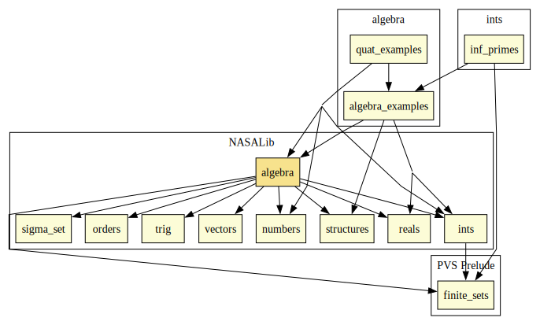

# Algebra

Group-, Ring-, and Field-like Mathematical Structures.

## Highlights

### Major theorems

| Theorem | Location | PVS Name | Contributors |
| --- | --- | --- | --- |
| Order of a Subgroup | `algebra@finite_group` | `lagrange` | David Lester |

# Contributors
* David Lester, Manchester University, UK & NIA, USA
* [Ricky Butler](https://shemesh.larc.nasa.gov/people/rwb/), NASA, USA
* [César Muñoz](http://shemesh.larc.nasa.gov/people/cam), NASA, USA
* [Sam Owre](http://www.csl.sri.com/users/owre), SRI, USA
* [Mariano Moscato](https://www.nianet.org/directory/research-staff/mariano-moscato/), NIA & NASA, USA

## Maintainer
* [César Muñoz](http://shemesh.larc.nasa.gov/people/cam), NASA, USA

# Dependencies

