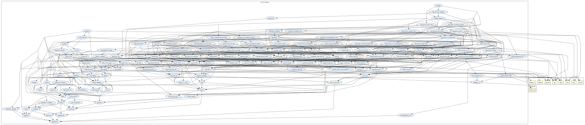

# Algebra

Group-, Ring-, and Field-like Mathematical Structures.

## Rings

The collection of theories reachable from `top_rings.top` provide several results on rings, for instance, the three isomorphism theorems, binomial theorem, theorems on maximal, prime and principal ideals, a general version of the Chinese Remainder Theorem (CRT) for rings on arbitrary domains, factorization on commutative rings, formalization of Unique Factorization Domains, amd a general version of Euclidean gcd algorithm for Euclidean Domains, among others.

An interesting feature of this generic version of the CRT is that it does not require commutativity for rings with identity. 
A numerical version of the CRT for the ring of integers is also provided as an instantiation of the generic form. 
Additionally, the correctness of the Euclidean Greatest Common Divisor (GCD) algorithm for the rings of integers and Gaussian integers are proved by instantiating the theorem concerning the correctness of the Euclidean GCD algorithm for Euclidean Domains. 

# Highlights

Main contributions:
  - Cauchy Theorem;
  - Isomorphism Theorems for Groups;
  - Burnside Theorem;
  - Sylow Theorems;
  - Lagrange Theorem;
  - Fundamental principle of counting;
  - Formula for permutation with repetition;
  - Group Action, stabilizer, orbit, normalizer, centralizer, index of a subgroup in a group, and properties;
  - Class Equation;
  - P-groups and properties;
  - Product of Subgroups;
  - Zn Group, Left and Right Cosets, Factor Group and properties;
  - Binomial Theorem for Rings; 
  - Isomorphism Theorems for Rings;
  - Principal, maximal and prime ideals and properties; 
  - Quotient rings and properties;
  - Boolean ring and properties; 
  - Chinese Remainder Theorem for Rings;
  - Chinese Remainder Theorem for the Ring of integers;
  - Primality of irreducible elements in Principal Ideal Domains; 
  - Principal Ideal Domains are Unique Factorization Domains; 
  - Correctness of the Euclidean gcd algorithm for Euclidean Domains; 
  - Correctness of the Euclidean gcd algorithm for the rings of integers and Gaussian integers;
  - Quaternions Algebra and properties;
  - Hamilton's Quaternions; 
  - Completeness of 3D rotations using Hamilton's Quaternions.
  

### Major theorems

| Theorem | Location | PVS Name | Contributors |
| --- | --- | --- | --- |
| Order of a Subgroup | `algebra@lagrange` | `Lagrange` | David Lester |
| First Isomorphism Theorem for Groups | `algebra@homomorphism_lemmas` | `first_isomorphism_th` | André Galdino |
| Second Isomorphism Theorem for Groups | `algebra@isomorphism_theorems` | `second_isomorphism_th` | André Galdino |
| Third Isomorphism Theorem for Groups | `algebra@isomorphism_theorems` | `third_isomorphism_th` | André Galdino |
| Correspondence Theorem for Groups | `algebra@isomorphism_theorems` | `correspondence_theorem` | André Galdino |
| Cauchy's Theorem for Finite Groups | `algebra@cauchy` | `cauchy` | André Galdino |
| Burnside's Theorem for p-Groups | `algebra@p_groups` | `burnside_theorem` | André Galdino |
| First Sylow Theorem | `algebra@sylow_theorems` | `First_Sylow_Theorem` | André Galdino |
| Second Sylow Theorem | `algebra@sylow_theorems` | `Second_Sylow_Theorem` | André Galdino |
| Third Sylow Theorem | `algebra@sylow_theorems` | `Third_Sylow_Theorem` | André Galdino |
| Binomial Theorem for Rings| `algebra@ring_binomial_theorem` | `R_bino_theo` | Andréia Avelar, Thaynara de Lima, André Galdino and Mauricio Ayala-Rincón| 
| Finite integral domains are fields| `algebra@finite_integral_domain` | `fin_int_domain_is_field` | Thaynara de Lima, Andréia Avelar, André Galdino and Mauricio Ayala-Rincón| 
| First Isomorphism Theorem for Rings| `algebra@ring_1st_isomorphism_theorem` | `first_isomorphism_th` | Andréia Avelar, Thaynara de Lima, André Galdino and Mauricio Ayala-Rincón| 
| Second Isomorphism Theorem for Rings| `algebra@ring_2nd_3rd_isomorphism_theorems` | `second_isomorphism_th` | Andréia Avelar, Thaynara de Lima, André Galdino and Mauricio Ayala-Rincón| 
| Third Isomorphism Theorem for Rings| `algebra@ring_2nd_3rd_isomorphism_theorems` | `third_isomorphism_th` | Andréia Avelar, Thaynara de Lima, André Galdino and Mauricio Ayala-Rincón| 
| Prime Ideals in Commutative Rings| `algebra@ring_with_one_prime_ideal` | `prime_ideal_charac` | Thaynara de Lima, Andréia Avelar, André Galdino and Mauricio Ayala-Rincón|
| Alternative characterization of principal ideals| `algebra@ring_principal_ideal` | `principal_ideal_charac`| Thaynara de Lima, Andréia Avelar, André Galdino and Mauricio Ayala-Rincón|  
| Maximal ideals in Commutative Rings| `algebra@ring_with_one_maximal_ideal` | `maximal_ideal_charac`| Thaynara de Lima, Andréia Avelar, André Galdino and Mauricio Ayala-Rincón|  
| Chinese Remainder Theorem for Rings| `algebra@chinese_remainder_theorem_rings` | `Chinese_Remainder_Theorem` | André Galdino, Thaynara de Lima, Andréia Avelar, and Mauricio Ayala-Rincón|
| Chinese Remainder Theorem for the Ring Z|`algebra@chinese_remainder_theorem_Z` | `Chinese_Remainder_Theorem_for_int` | André Galdino, Thaynara de Lima, Andréia Avelar, and Mauricio Ayala-Rincón|
| Primality of irreducible elements in Principal Ideal Domains| `algebra@principal_ideal_domain` | `PID_prime_el_iff_irreducible` | Thaynara de Lima, André Galdino, Andréia Avelar, and Mauricio Ayala-Rincón|
| Principal Ideal Domains are Unique Factorization Domains| `algebra@ring_unique_factorization_domain` | `PID_is_UFD` | Thaynara de Lima, André Galdino, Andréia Avelar, and Mauricio Ayala-Rincón|
| Correctness of the Euclidean gcd algorithm for Euclidean Domains| `algebra@ring_euclidean_algorithm` | `euclidean_gcd_alg_correctness` | André Galdino, Thaynara de Lima, Andréia Avelar, and Mauricio Ayala-Rincón|
| Correctness of the Euclidean gcd algorithm for integers instantiating `euclidean_gcd_alg_correctness` | `algebra@ring_euclidean_gcd_algorithm_Z` | `euclidean_gcd_alg_correctness_in_Z` | André Galdino, Thaynara de Lima, Andréia Avelar, and Mauricio Ayala-Rincón|
| Correctness of the Euclidean gcd algorithm for Gaussian integers| `algebra@ring_euclidean_gcd_algorithm_Zi` | `euclidean_gcd_alg_in_Zi` | André Galdino, Thaynara de Lima, Andréia Avelar, and Mauricio Ayala-Rincón|
| Characterization of Quaternions as Division Rings| `algebra@quaternions` | `quat_div_ring_char` |  Thaynara de Lima, André Galdino, Andréia Avelar, and Mauricio Ayala-Rincón|
| Completeness of Hamilton's Quaternions 3D rotation| `algebra@quaternions_Hamilton` | `Quaternions_Rotation` | André Galdino, Thaynara de Lima, Andréia Avelar, Bruno Ribeiro, and Mauricio Ayala-Rincón|

# Contributors
* David Lester, Manchester University, UK & NIA, USA
* [Ricky Butler](https://shemesh.larc.nasa.gov/people/rwb/), NASA, USA
* [André Luiz Galdino](https://galdino.catalao.ufg.br), Federal University of Catalão, Brazil
* Andréia Borges Avelar, University of Brasília, Brazil
* [Thaynara Arielly de Lima](https://thaynaradelima.github.io), Federal University of Goiás, Brazil
* André Camapum Carvalho de Freitas, Federal University of Goiás, Brazil
* Bruno Berto de Oliveira Ribeiro, University of Brasília, Brazil
* [Mauricio Ayala-Rincón](http://www.mat.unb.br/~ayala), University of Brasília, Brazil
* [César Muñoz](http://shemesh.larc.nasa.gov/people/cam), NASA, USA
* [Mariano Moscato](https://www.nianet.org/directory/research-staff/mariano-moscato/), NIA & NASA, USA
* [Sam Owre](http://www.csl.sri.com/users/owre), SRI, USA

## Maintainer
* [César Muñoz](http://shemesh.larc.nasa.gov/people/cam), NASA, USA

# Dependencies

# References
* M. Ayala-Rincón, T. A. de Lima, A. Borges Avelar, A. L. Galdino. *Formalization of Algebraic Theorems in PVS.* In Proceedings of 24th International Conference on Logic for Programming, Artificial Intelligence and Reasoning LPAR, EPiC Series in Computing, vol. 94:1-10  [doi](https://doi.org/10.29007/7jbv),  2023.

* T. A. de Lima, A. L. Galdino, A. Borges Avelar, and	M. Ayala-Rincón. *Formalization of Ring Theory in PVS - Isomorphism Theorems,	Principal, Prime and Maximal Ideals,Chinese	Remainder Theorem. Journal of Automated Reasoning,  [doi](https://doi.org/10.1007/s10817-021-09593-0),  2021.  

