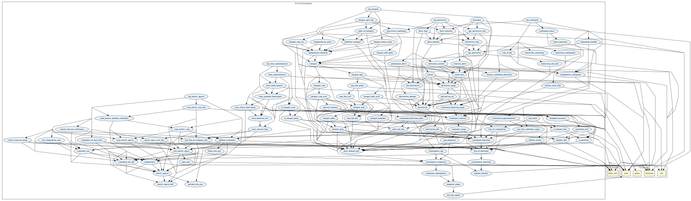

# Analysis

Real analysis, limits, continuity, derivatives, integrals.

## Highlights

### Major theorems

| Theorem | Location | PVS Name | Contributors |
| --- | --- | --- | --- |
|Intermediate Value Theorem  |`analysis@continuity_interval`|`intermeditate_value1`| Bruno Dutertre |
|Mean Value Theorem |`analysis@derivative_props`|`mean_value`| Bruno Dutertre |
|Fundamental Theorem of Calculus |`analysis@fundamental_theorem`|`fundamental`| Ricky Butler |
|Taylor's Theorem   |`analysis@taylors`|`Taylors`| icky Butler |
|Heine Theorem and Multi-ary Variants |`analysis@uniform_continuity`|`Heine`| Anthony Narkawicz |

# Contributors
* Anthony Narkawicz, formerly NASA, USA
* Bruno Dutertre, formerly at SRI, USA
* Ricky Butler, formerly at NASA, USA
* [César Muñoz](http://shemesh.larc.nasa.gov/people/cam), NASA, USA
* J. Tanner Slagel, NASA, USA
* Mariano Moscato, AMA @ NASA, USA
* Sam Owre, formerly at SRI, USA
* [Aaron Dutle](http://shemesh.larc.nasa.gov/people/amd), NASA, USA

## Maintainer
* [César Muñoz](http://shemesh.larc.nasa.gov/people/cam), NASA, USA

# Dependencies

