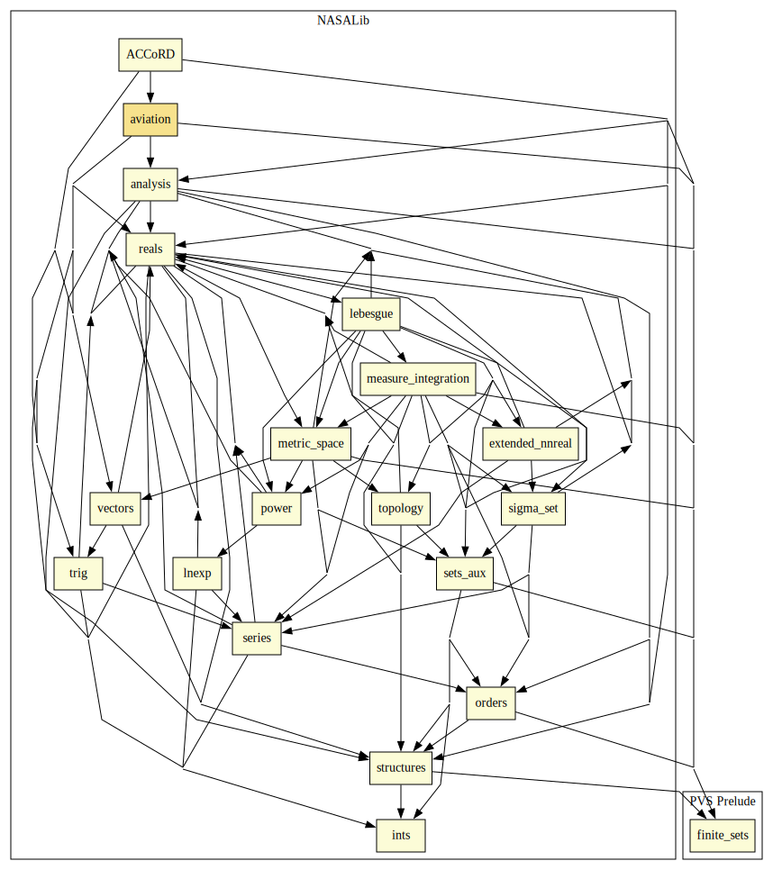

# Aviation

Support definitions and properties for aviation-related formalizations.

Restrictions/Assumptions: 
  - no roll, i.e., instantaneous change to target bank angle (from 0)
  - constant ground speed, i.e., constant track rate
  - constant vertical speed

Notes:
  - turn dynamics are determined by the bank angle and ground speed
  - turn elements: speed, bank angle, radius, track rate
  - bank angles can be signed (positive:right) or unsigned

## Highlights

### Major theorems

| Theorem | Location | PVS Name | Contributors |
| --- | --- | --- | --- |

# Contributors
* Radu Siminiceanu, NIA, USA
* [Ricky Butler](http://shemesh.larc.nasa.gov/people/rwb), NASA, USA
* [César Muñoz](http://shemesh.larc.nasa.gov/people/cam), NASA, USA
* [Aaron Dutle](http://shemesh.larc.nasa.gov/people/amd), NASA, USA
* [Mariano Moscato](https://www.nianet.org/directory/research-staff/mariano-moscato/), NIA & NASA, USA
* [Sam Owre](http://www.csl.sri.com/users/owre), SRI, USA

## Maintainer
* [César Muñoz](http://shemesh.larc.nasa.gov/people/cam), NASA, USA

# Dependencies

