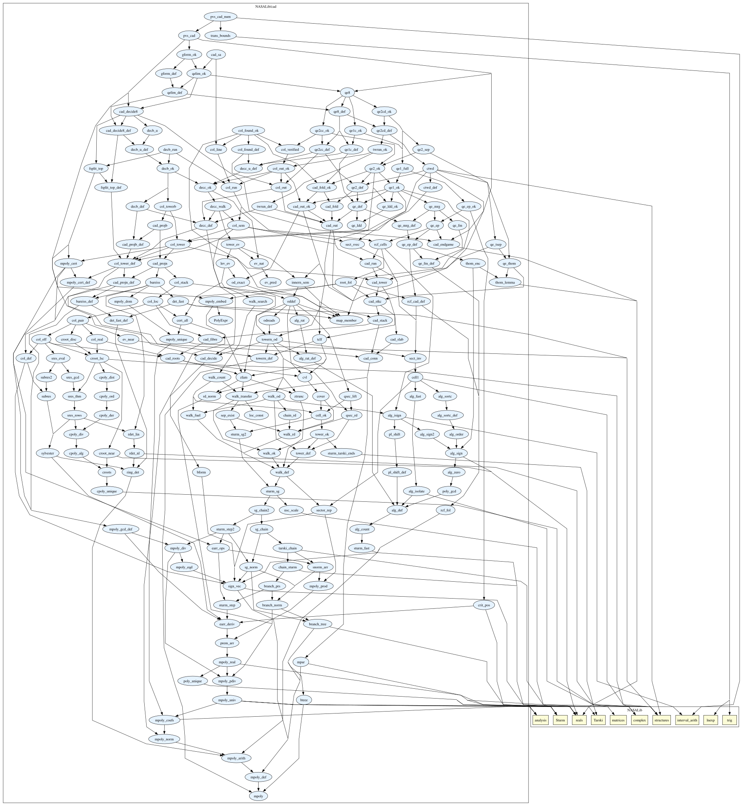
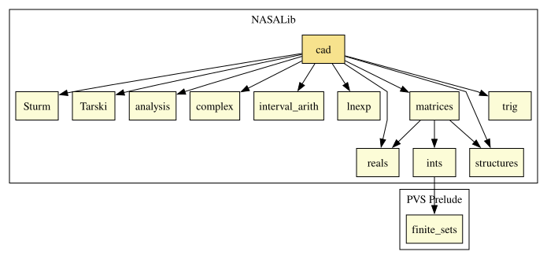

# cad

Cylindrical algebraic decomposition (CAD) for PVS: an executable construction based on
Collins's projection, proved to give a CAD of R^n adapted to any family of polynomials with
rational coefficients, in any number of variables. On top of it the library has a decision
procedure for the first-order theory of the real numbers and quantifier elimination, both
proved sound and complete. The strategies `cad` and `cad-qe` use them to prove formulas of real
arithmetic in one step: they run the verified procedure in PVS's ground evaluator and turn its
answer into a proof that the PVS kernel checks, as NASALib's `sturm` and `tarski` strategies do
for one variable. Their soundness rests on the logic of PVS, not on an external oracle.

## Highlights

* **The CAD is proved, not certified at run time.** For every family F in k + 1 variables, the
  cells built from the tower of Collins projections cover R^(k+1) and are disjoint; the cells of
  every level are connected; each level is delineable over the cells below it, its roots given
  by continuous, strictly ordered functions; F has one sign vector on every cell; and every cell
  and root graph is definable (Basu, Pollack and Roy, *Algorithms in Real Algebraic Geometry*,
  Defs. 5.1 and 5.5). One variable is included.
* **The CAD as data.** `col_found` returns at least one record for every nonempty cell and
  none for any other, each with an exact (possibly algebraic) sample point and F's signs there;
  the records decide every sentence over F.
* **Complete decision.** `decide8` decides every prenex sentence and `decide_g` every sentence of
  any shape: both always answer, and the answer is the truth.
* **Quantifier elimination.** `qe8` (prenex formulas) and `qelim` (formulas of any shape, any
  number of free variables) return quantifier-free equivalents. So the Tarski–Seidenberg
  theorem holds for formulas with rational coefficients, and every cell is semi-algebraic.
* **Formulas as written.** The strategies take PVS formulas as they are: grouped binders,
  quantifiers inside connectives, binders over `posreal` and the other subtypes of `real`, and
  terms such as `sqrt`, `abs`, `max`, `min`, quotients, constants like `pi`, and `sin`, `cos`,
  `exp`, `ln`, `atan` of constants.

### Major theorems

| Theorem | Location | PVS Name |
| --- | --- | --- |
| Collins's projection gives a CAD adapted to F, for every F and every number of variables | `cad@col_line` | `col_cells` |
| Delineability from Collins's projection (Collins's theorem) | `cad@col_stack` | `collins_stack` |
| The CAD as data: a record with a sample point for every nonempty cell | `cad@col_found_ok` | `col_found_cad` |
| The records decide every sentence over F | `cad@col_found_ok` | `col_found_decides` |
| The decision's run is a CAD adapted to the family it decides | `cad@decb_run` | `decb_cad_run`, `decb_cad_input` |
| The decision is sound and complete | `cad@cad_decide8` | `decide8_correct`, `decide8_decides` |
| The decision of formulas of any shape | `cad@gform_ok` | `decide_g_ok` |
| Quantifier elimination for prenex formulas | `cad@qe8` | `qe8_complete` |
| Quantifier elimination for every first-order formula | `cad@qelim_ok` | `qelim_qf`, `qelim_ok` |
| Tarski–Seidenberg: first-order definable = quantifier-free definable (over Q) | `cad@qelim_ok` | `fod_qfd` |
| Every cell, at every level, is semi-algebraic | `cad@cad_sa` | `col_cells_sa` |

The decision is stated for a sentence encoded as data: `os`, its quantifiers outermost first,
`F`, its polynomials, and `phi`, its Boolean skeleton. `fsem` is its meaning, written with PVS's
own quantifiers:

```
decide8_decides: THEOREM decide8(reverse(os), F, phi)`val IFF fsem(os, F, phi, null)
qe8_complete:    THEOREM cons?(os) AND length(pt) = m IMPLIES
                   qf?(qe8(m, os, F, phi)`out) AND
                   (qfsem(qe8(m, os, F, phi)`out)(pt) IFF fsem(os, F, phi, pt))
```

## Getting started

```
IMPORTING cad@pvs_cad        % (cad), (cad-direct), (cad-qe), (cad-facts)
IMPORTING cad@pvs_cad_num    % also constants such as pi and e, and sin, cos, exp, ln, atan
```

`pvs_cad` brings everything the strategies need. The theorems in the table above that it
does not import (`col_cells`, `col_found_cad`, `decb_cad_run`, `col_cells_sa`, ...) are in
`col_line`, `col_found_ok`, `decb_run` and `cad_sa`. A session:

```
quadratic_formula :
  |-------
{1}   FORALL (a, b, c: real):
        EXISTS (x: real):
          a /= 0 AND b ^ 2 >= 4 * a * c IMPLIES a * x ^ 2 + b * x + c = 0

Rule? (cad)
Deciding 1 by cylindrical decision, witness first,
Q.E.D.
```

## Strategies

### `cad`: Deciding first-order formulas over the reals

#### Syntax

`(cad &optional (fnum 1) (budget 10) cad-only?)`

#### Description

Decides formula `fnum`, a first-order formula over the reals whose atoms compare polynomials.
A true goal is proved and a false hypothesis closes the goal; otherwise the formula stays,
labelled `cad`, and a message says whether it is TRUE or FALSE. The formula may have any shape:
prenex formulas are decided by `decide8`, others by `decide_g`. Real terms that do not mention
a bound variable (`f(c)`, `sqrt(c)`, `length(l)`) become unknowns with the bounds their types
give.

Before the full decision, `cad` looks for a witness: a point that settles the formula, or, with
three or more quantifiers when the decision does not answer within `budget` seconds, a constant
for one variable and the smaller sentence decided. With `cad-only?` set, every answer comes from
the verified CAD engine alone, with no witness search.

* `(cad 2)`, `(cad -1)`: the formula with that number, a goal or a hypothesis.
* `(cad *)`, `(cad +)`, `(cad -)`, `(cad (-1 2))`: the whole sequent, the goals, the hypotheses,
  or the chosen formulas, decided together as one implication.
* `sqrt`, `abs`, `max`, `min` and quotients are pinned down by the facts that define them; under
  a binder they are read into an equivalent formula without them.
* When the decision with unknowns does not prove the goal, `cad` calls `cad-num`.

### `cad-direct`: The decision alone

#### Syntax

`(cad-direct &optional (fnum 1) cad-only?)`

#### Description

As `cad`, without the witness search.

### `cad-qe`: Quantifier elimination

#### Syntax

`(cad-qe &optional (fnum 1))`

#### Description

Replaces formula `fnum`, which has one or more free real terms, by an equivalent
quantifier-free formula, computed by `qe8` (`qe_g` for formulas that are not prenex) and proved
equivalent from `qe8_correct` (`qe_g_ok`). The answer is printed:

```
{-1}   EXISTS (t: real): t ^ 2 + a * t + b = 0
Rule? (cad-qe -1)
cad-qe: ((b < 0) OR ((b = 0) OR ((b > 0) AND ((4*b + (-1)*a^2 = 0) OR (4*b + (-1)*a^2 < 0)))))
```

### `cad-num`: Pinning down constants and functions of constants

#### Syntax

`(cad-num &optional (fnums *) (budget 10) (precisions (3 6 10 16 24)) (splits 5) cad-only?)`

#### Description

Decides `fnums` as `(cad *)` does, after adding hypotheses that pin down their non-polynomial
terms: the exact facts of `cad-facts`; enclosures between two rationals, proved by NASALib's
`numerical`, for constants such as `pi`, `e`, `sin(1)`, `ln(2)`, with the precision raised
through `precisions`; for `sin`, `cos`, `exp`, `ln` and `atan` of constants, proved polynomial
bounds (`trans_bounds`), then enclosures over pieces of the ranges the hypotheses give, halved
up to `splits` times. It says when the goal is FALSE for every value the enclosures allow. The
enclosures and bounds need `IMPORTING cad@pvs_cad_num`.

### `cad-facts`: The exact facts

#### Syntax

`(cad-facts &optional (fnums *))`

#### Description

Adds, as hypotheses, the facts that pin down every `sqrt(t)`, `abs(t)`, `max(a, b)`, `min(a, b)`
and `t / u` in `fnums` (`sqrt(t) >= 0` and `sqrt(t) * sqrt(t) = t`, the cases of `abs`, `max`
and `min`, `(t / u) * u = t`), and the ranges of `sin`, `cos` and `atan`.

## Examples

See `cad_examples/` (`cad_examples/top.pvs` describes each theory). `cad_showcase` shows every way to
call the strategies on 43 examples; `cad_hard_ex` has problems that are hard for CAD
(Wilkinson's polynomial of degree 20, Chebyshev's of degree 30, AM–GM and Schur's inequality
in three variables, Cauchy–Schwarz in the plane), each proved in a few seconds; `cad_results_ex`
applies the major theorems to the unit circle; `cad_forms_ex` and `cad_terms_ex` are the
regression sets for the shapes of formulas and the terms the strategies accept.



## Trust and limits

What is trusted is what NASALib's `sturm` and `tarski` strategies trust: the PVS kernel and its
ground evaluator, which runs the procedures inside the proof (and, with `pvs_cad_num`, the
interval evaluations of `numerical`). The strategy code is not trusted; it only chooses proof
steps. CAD is doubly exponential in the worst case: problems with four or more variables of
higher degree can take minutes or longer (AM–GM in four variables does not finish in two
minutes). The projection is Collins's (with a smaller one at the bottom level, proved for that
use); the smaller projections of McCallum, Brown and Lazard are not part of the library.

## How it was made

Everything in this library, the specifications and every proof, was generated with Claude
models (Claude Fable 5.1, Claude Opus 5 and Claude Opus 5.5) through Claude Code, directed by
J. Tanner Slagel. PVS checks every step of every proof.

# Contributors
* J. Tanner Slagel

## Maintainer
* J. Tanner Slagel

# Dependencies
NASALib's `reals`, `Sturm`, `Tarski`, `structures`, `analysis`, `complex`, `matrices`,
`interval_arith`, `trig` and `lnexp`.


