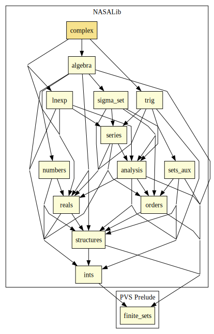

# Complex Numbers

The complex numbers are defined (axiomatically) in this way so that we can conveniently use the numeric constants 0, 1, 2 etc.
The alternative -- using pairs of reals to represent the real and imaginary components -- would lead to the somewhat unappealing formulation of Euler's result as "exp((0,1)*(pi,0)) = (-1,0)".
As a matter of taste, this formalization allows the somewhat more elegant formulation: "exp(i*pi) = -1".

## Highlights

### Major theorems

| Theorem | Location | PVS Name | Contributors |
| --- | --- | --- | --- |

# Contributors
* [David Lester](http://apt.cs.man.ac.uk/people/dlester), Manchester University, UK
* Anthony Narkawicz, NASA, USA
* [César Muñoz](http://shemesh.larc.nasa.gov/people/cam), NASA, USA
* [Sam Owre](http://www.csl.sri.com/users/owre), SRI, USA
* [Mariano Moscato](https://www.nianet.org/directory/research-staff/mariano-moscato/), NIA & NASA, USA

## Maintainer
* [César Muñoz](http://shemesh.larc.nasa.gov/people/cam), NASA, USA

# Dependencies

