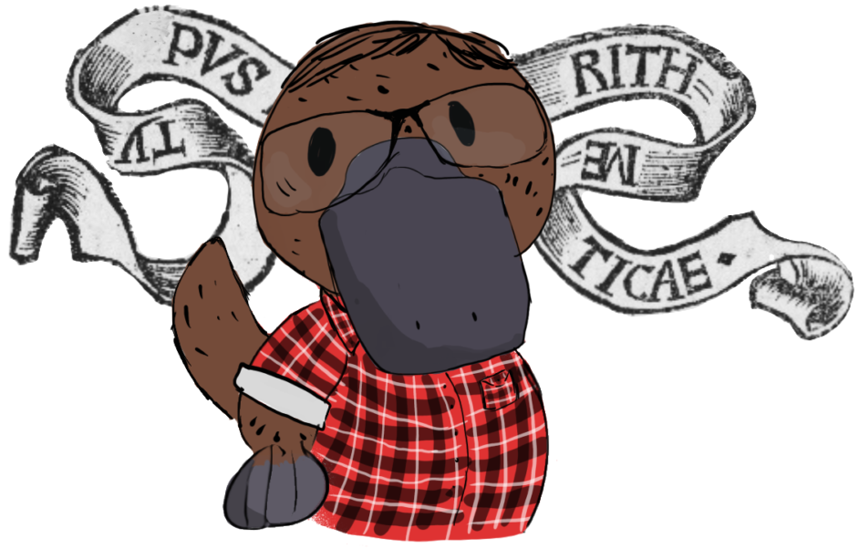
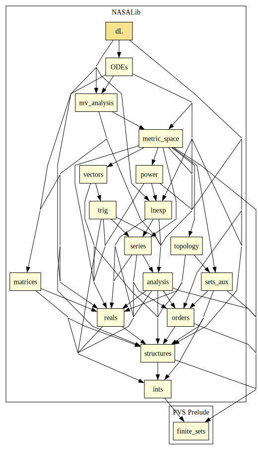
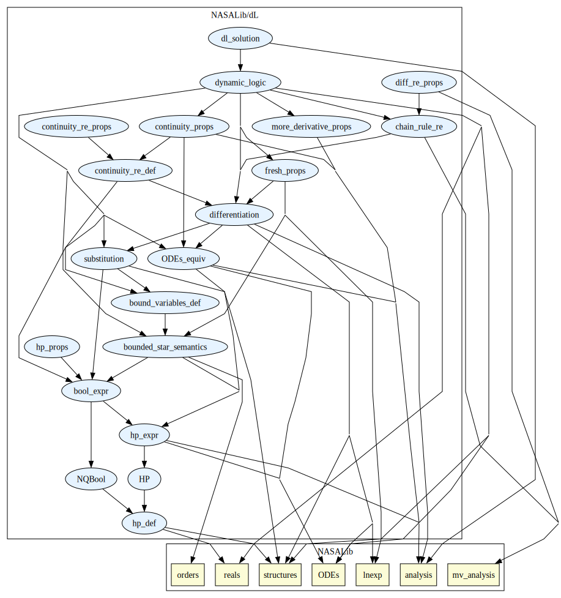

# Differential Dynamic Logic

This library contains an operational embedding of differential dynamic logic for the formal verification of hybrid systems. 
Hybrid systems contain continuously evolving and discretely evolving components, and arise in many safety- and mission-critical applications.
Differential dynamic logic (dL) is a framework for formally specifying and reasoning about hybrid programs, where the specification allows modeling of hybrid systems, and its proof calculus allows for reasoning about such potentially complex programs. 
This embedding of dL is operational, meaning that it leverages the internal logic of PVS, resulting in a version of dL whose proof calculus is not only formally verified, but is also executable within PVS itself. The result is a **P**roper**l**y **A**ssured **I**mplementation of **D**ifferential Dynamic Logic for H**y**brid **P**rogram **V**erification and **S**pecification, **Plaidypvs**. 

 Image credit: Esther Conrad 

## External Dependencies

## Internal Summary

| Theory Name | Description |
|---|---|
| [`hp_def`](hp_def.pvs) | Preliminary definitions for hybrid programs |
| [`HP`](HP.pvs) | Datatype denoting hybrid programs |
| [`NQBool`](NQBool.pvs) | Datatype for non-quantified boolean hybrid program expressions | 
| [`hp_expr`](hp_expr.pvs) | More basics of hybrid programs including input/output semantics |
| [`bounded_star_semantics`](bounded_star_semantics.pvs) | Defines bounded star hybrid program and shows equivalence to star hybrid program |
| [`bound_variables_def`](bound_variables_def.pvs) | Defined bound variables for an HP |
| [`bool_expr`](bool_expr.pvs) | Defines boolean expressions and normalizeed nonquantifeid boolean expressions |
| [`hp_props`](hp_props.pvs) | Example of reasoning about HP at the semantic definition level |
| [`substitution`](substitution.pvs) | Defines subsitution with properties for common real and boolean expressions |
| [`ODEs_equiv`](ODEs_equiv.pvs) | Connects ODE library to ODEs |
| [`differentiation`](differentiation.pvs) | Establishes rules of differentation |
| [`chain_rule_re`](chain_rule_re.pvs) | Proves chain rule for real expressions from chain rule in mv_analysis library |
| [`diff_re_props`](diff_re_props.pvs) | Standard properties of differentiable real expressions |
| [`continuity_re_def`](continuity_re_def.pvs) | Define continuity of real expressions |
| [`continuity_props`](continuity_props.pvs) | Continuity properties for real expressions and environments |
| [`continuity_re_props`](continuity_re_props.pvs) | Standard arithmetic properties of continuous real expressions |
| [`fresh_props`](fresh_props.pvs) | Established properties of fresh variables |
| [`bound_variables_def`](bound_variables_def.pvs) | Define bound variables |
| [`dynamic_logic`](dynamic_logic.pvs) | Rules and rewrites of differential dynamic logic |
| [`dl_solution`](dl_solution.pvs) | Dl solve rule with examples |
| [`sem_rel_diff_star`](sem_rel_diff_star.pvs) | Added rule to dL that was required for this development. The rules removes a  STAR operator from Differential program | 
| [`dL_examples/`](dL_examples/) | Directory of examples of using dL in PVS |

# Contributors
* J Tanner Slagel, NASA, USA
* Mariano Moscato, National Institute of Aerospace, USA
* Lauren White, NASA, USA 
* César Muñoz, NASA, USA
* Swee Balachandran, National Institute of Aerospace, USA
* [Aaron Dutle](http://shemesh.larc.nasa.gov/people/amd), NASA, USA

## Maintainer
* J Tanner Slagel, NASA, USA, <j.tanner.slagel@nasa.gov>

