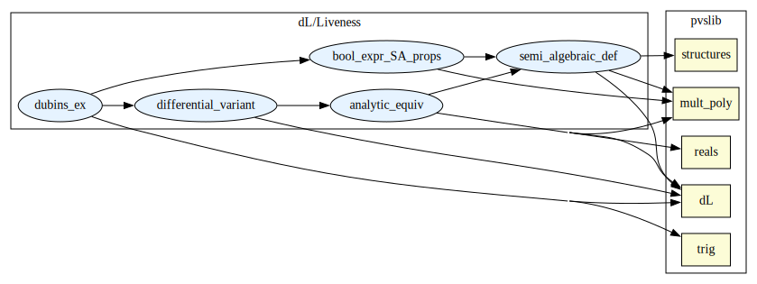

# A proof rule for Eventuality

This library utilizes the embedding of differential dynamic logic for the formal verification of hybrid systems, Plaidypvs, to construct a proof rule for the evetuality property of a hybrid system. The eventuality property asserts that there exists some path solution, following the dynamics given by a differential system, that starts in  a given initial set and ends in a target set. A proof rule is given that defines conditions for the system. These conditions rely on the theory of analytic functions and their movement through sets defined by polynomial inequalities, called semi-algebraic sets. 

## External Dependencies

## Internal Summary

| Theory Name | Description |
|---|---|
| [`semi_algebraic_def`](semi_algebraic_def.pvs) | Defining semi-algebraic sets in the Plaidypus syntax and relating it to the definition in Mult_Poly |
| [`bool_expr_SA_props`](bool_expr_SA_props.pvs) | Connecting the definition of Real Expressionsa and Boolean Expressions in Plaidypvs to the definition of multi-variate polynomials and semi-algebaic sets |
| [`analytic_equiv`](analytic_equiv.pvs) | Defining analytic on an interval for solution types of ODEs and showing equivalence to the analytic def in MultPoly |
| [`differential_variant`](differential_variant.pvs) | The proof rule for the eventuality property of a hybrid system. |
| [`dubins_ex`](dubins_ex.pvs) | Exploratory example outlined in the tool paper "Using Plaidypvs for Proving Eventuality in Hybrid Programs" which involves a fixed wing craft executing a turn governed by a Dubin's path to return to some designated safe zone XT. |

# Contributors
* J Tanner Slagel, NASA, USA
* Lauren M White, NASA, USA 

## Maintainer
* Lauren M White, NASA, USA, <lauren.m.white@nasa.gov>

