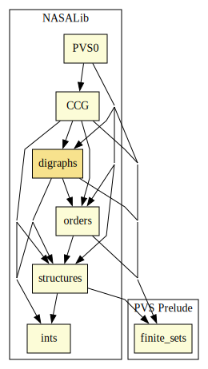

# Digraphs

Directed graphs: circuits, maximal subtrees, paths, DAGs.

## Highlights

### Major theorems

| Theorem | Location | PVS Name | Contributors |
| --- | --- | --- | --- |

# Contributors
* Andreia Avelar Borges, University of Brasilia, Brazil
* Jon Sjogren, Department of Defense, USA
* [Kristin Rozier](http://ti.arc.nasa.gov/profile/kyrozier), NASA, USA
* [Ricky Butler](http://shemesh.larc.nasa.gov/people/rwb), NASA, USA
* [César Muñoz](http://shemesh.larc.nasa.gov/people/cam), NASA, USA
* [Mariano Moscato](https://www.nianet.org/directory/research-staff/mariano-moscato/), NIA & NASA, USA
* [Sam Owre](http://www.csl.sri.com/users/owre), SRI, USA
* Thomas Norris

## Maintainer
* [César Muñoz](http://shemesh.larc.nasa.gov/people/cam), NASA, USA

# Dependencies

