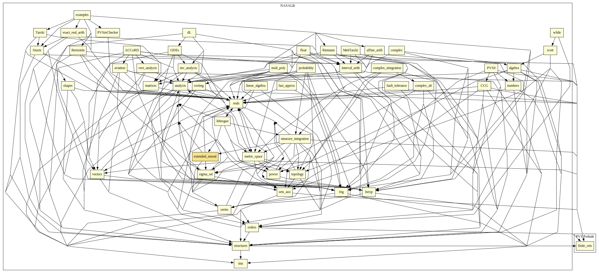

# Extended non-negative reals

Main contributions include:
 * A coding for diagonalizing a sequence
 * Double and single indexing for sequences
 * Convergence properties of doubly indexed sequences of non-negative reals

## Highlights

### Major theorems

| Theorem | Location | PVS Name | Contributors |
| --- | --- | --- | --- |

# Contributors
* [David Lester](http://apt.cs.man.ac.uk/people/dlester), Manchester University, UK
* [César Muñoz](http://shemesh.larc.nasa.gov/people/cam), NASA, USA
* [Sam Owre](http://www.csl.sri.com/users/owre), SRI, USA
* [Mariano Moscato](https://www.nianet.org/directory/research-staff/mariano-moscato/), NIA & NASA, USA

## Maintainer
* [César Muñoz](http://shemesh.larc.nasa.gov/people/cam), NASA, USA

# Dependencies

