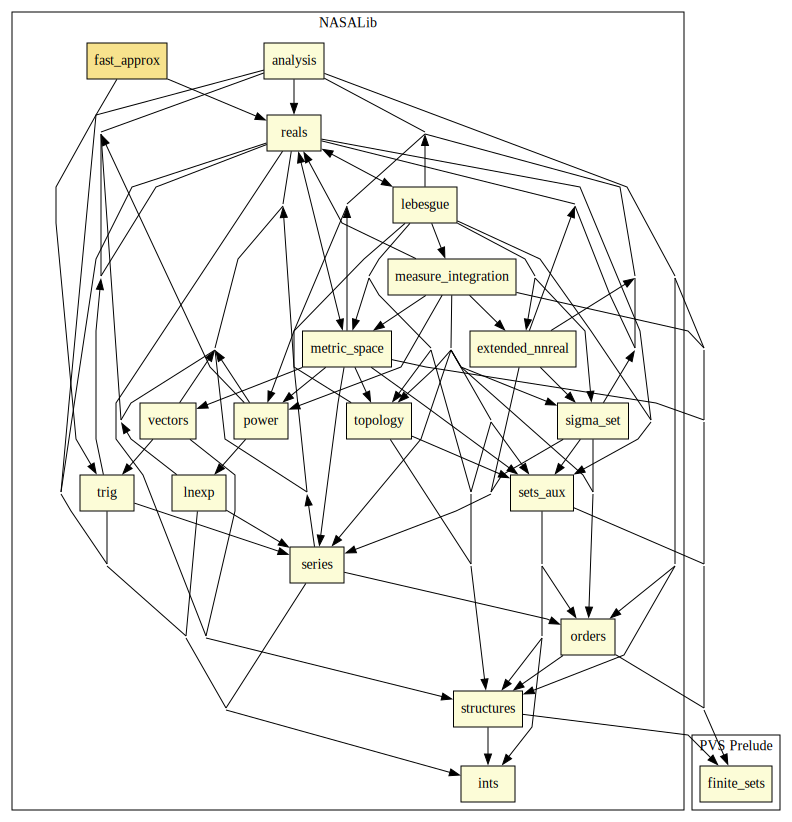

# Fast Approximation of Numerical Functions

This library defines approximations of standard functions which can't be computed exactly. 
The main contributions are 
- `sqrt_fast_approx(x,eps)`
- `sin_fast_approx(x,eps)`
- `cos_fast_approx(x,eps)`
- `tan_fast_approx(x,eps)`
- `pi_fast_approx(eps)` and `pi_fast_approx_br(eps)`
- `pihalf_fast_approx(eps)` and `pihalf_fast_approx_br(eps)`
- `atan_fast_approx(x,eps, p2)`  (`p2` should be an approximation of `pi/2`)
The file `fast_approx_props.pvs` holds lemmas verifying that the approximations are accurate to within `eps`, for specified ranges for the inputs `x` and `eps`.

## Highlights

### Major theorems

| Theorem | Location | PVS Name | Contributors |
| --- | --- | --- | --- |

# Contributors
* [César Muñoz](http://shemesh.larc.nasa.gov/people/cam), NASA, USA
* [Aaron Dutle](http://shemesh.larc.nasa.gov/people/amd), NASA, USA
* [Mariano Moscato](https://www.nianet.org/directory/research-staff/mariano-moscato/), NIA & NASA, USA
* [Sam Owre](http://www.csl.sri.com/users/owre), SRI, USA

## Maintainer
* [César Muñoz](http://shemesh.larc.nasa.gov/people/cam), NASA, USA

# Dependencies

