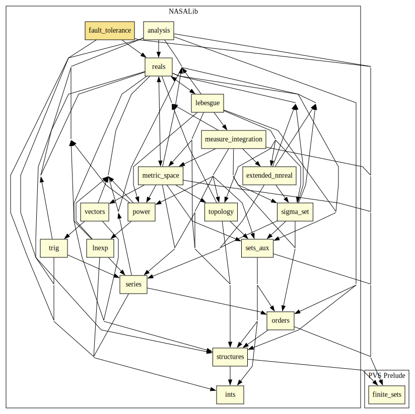

# Fault tolerance protocols

## Highlights

### Major theorems

| Theorem | Location | PVS Name | Contributors |
| --- | --- | --- | --- |

# Contributors
* Alfons Geser, HTWK Leipzig, Germany
* [Jeff Maddalon](http://shemesh.larc.nasa.gov/people/jmm), NASA, USA
* [Lee Pike](http://corp.galois.com/lee-pike), Galois, USA
* [Paul Miner](http://shemesh.larc.nasa.gov/people/psm), NASA, USA
* [César Muñoz](http://shemesh.larc.nasa.gov/people/cam), NASA, USA
* [Aaron Dutle](http://shemesh.larc.nasa.gov/people/amd), NASA, USA
* [Mariano Moscato](https://www.nianet.org/directory/research-staff/mariano-moscato/), NIA & NASA, USA
* [Sam Owre](http://www.csl.sri.com/users/owre), SRI, USA

## Maintainer
* [César Muñoz](http://shemesh.larc.nasa.gov/people/cam), NASA, USA

# Dependencies

