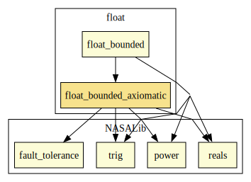
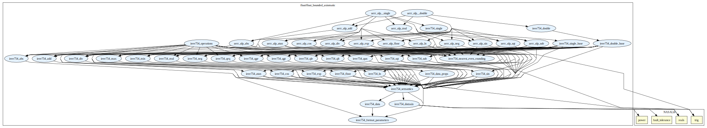
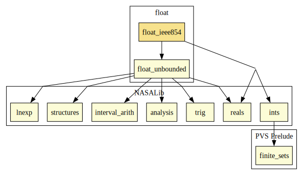
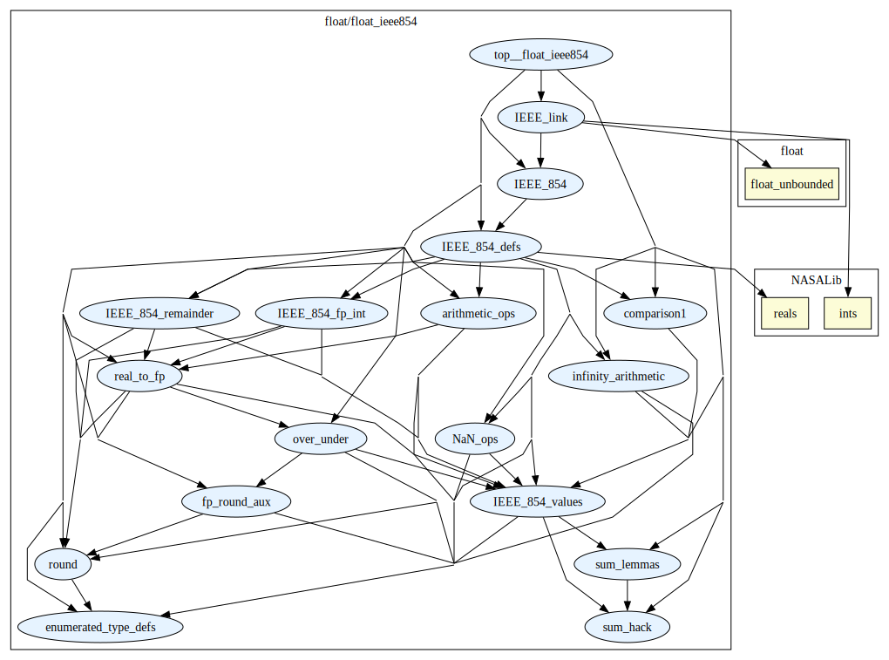
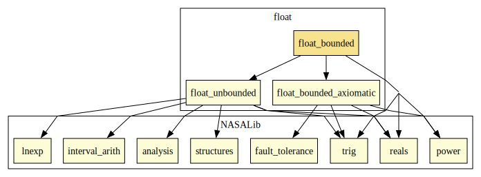
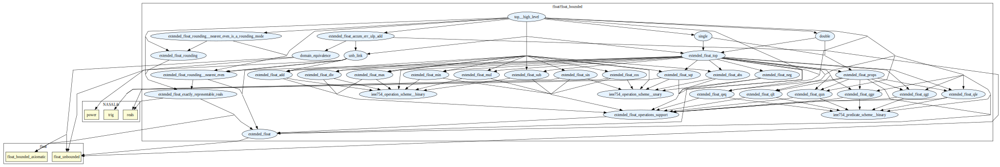
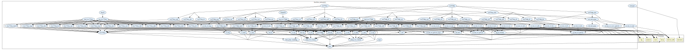

# Floating-Point Library

This library contains several formalizations of floating-point numbers.

* *float_bounded_axiomatic*: An axiomatic formalization that complies with the IEEE 754 standard
* *float_ieee854*: A low-level foundational formalization following the IEEE 854 Standard
* *float_bounded*: A high-level foundational specification which can be instantiated to provide IEEE 754 floating-points.
* *float_unbounded*: A high-level foundational formalization representing floating-points without upper nor lower bounds. It is also proven that a reduced version of this specification is equivalent to the one for IEEE 854 floating-point numbers.

## Axiomatic Formal Description of the IEEE 754 Standard (*float_bounded_axiomatic*)
*Author:* Mariano Moscato

This library presents an axiomatic formalization of the floating-point numbers defined in the 754 standard by IEEE. The formalization is parametric in the values that define a specific format according to the standard: _radix_ (`b`), _precision_(`p`), and _maximum exponent_(`emax`). It accepts the values defined by the standard.

|        | binary32 | binary64 | binary128 | decimal64 | decimal128
| ------ | :-:   | :-:       | :-:         | :-: | :-: |
| `b`    |  2       | 2        | 2         | 10  | 10 |
| `p`    |  24      | 53       | 113       | 16  | 34 |
| `emax` | 127      | 1023     | 16383     | 384 | 6144 |

These parameters are present in every theory defining general aspects of the floating-point values.
Some example instantiations for specific formats are provided in the theories:

*  `ieee754_single` for _binary32_, and
*  `ieee754_double` for _binary64_.

There, definitions for the specifically instantiated floating-point datatype as well as for the operations are provided for convenience of the user.

Several operations on floating-point data are specified according to the standard.
At the moment, support for the following operations is provided:

* `ieee754_qlt`: quiet less than
* `ieee754_qle`: quiet less or equal than
* `ieee754_qgt`: quiet greater than
* `ieee754_qgt`: quiet greater or equal than
* `ieee754_qeq`: quiet equal to
* `ieee754_qun`: quiet unordered
* `ieee754_add`: addition
* `ieee754_sub`: subtraction
* `ieee754_div`: division
* `ieee754_mul`: multiplication 
* `ieee754_max`: maximum (of two numbers)
* `ieee754_min`: minimum (of two numbers)
* `ieee754_abs`: absolute value
* `ieee754_sqt`: square root

Nevertheless, flags and exceptions are not currently supported.

The theory `ieee754_data` contains fundamental declarations and properties, such as the datatype denoting floating-point data and its special values (_NaN_, _infinites_, _zeros_). Properties of the fragment of the real numbers being represented by floating-point numbers are provided in the theory `ieee754_domain`. The connection between both theories is established in `ieee754_semantics` where notions such as rounding and projection are specified.

The theory hierarchy is shown below. The arrows depict dependencies among theories.

where `op` = `add` | `sub` | `mul` | `div` | `max` | `min` | `abs` | `sqt` | `qlt` | `qle` | `qgt` | `qge` | `qeq` | `qun`.

### Dependencies

* Library level

* Theory level

## Low-level Formalization of IEEE 854 Floating-Point Numbers (*float_ieee854*)
*Author:* Paul Miner

This is a hardware level model of floating-point numbers as described by the IEEE 854 Standard. See [5] for details.

### Dependencies

* Library level

* Theory level

## High-level Formalization of Floating Point Numbers (*float_bounded* and *float_unbounded*)
*Author:* Sylvie Boldo, Cesar Muñoz, Mariano Moscato

This formalization was initiated by Sylvie Boldo [1,2] while visiting the National Institute of Aerospace (NIA) in late 2005.
It was augmented by Mariano Moscato (NIA, 2016) in order to provide support for round-off error calculations, serving as the formal support for the certificates generated by PRECiSA [3].

In mid 2019, Mariano Moscato introduced an extension of this formalization incorporating special values to the representation, namely infinities, not-a-number values, and signed zeros. 
This extension is parametric on the following values, which determine an specific representation format (see [2] for details).

* `radix` integer greater than 0
* `precision` integer greater than 0
* `dExp` integer greater than `2*(precision-1) - 1`

Note that formats equivalent to the ones defined by the IEEE 754
standard can be set by using the values shown in the table below. 

|             | single precision | double precision |
| ----------- | :--------------: | :--------------: |
| `radix`     | 2                | 2                |
| `precision` | 24               | 53               |
| `dExp`      | 149              | 1074             |

Instantiations for these formats are provided in the theories `single`
and `double`. These theories should serve as the entry point to users
needing to manipulate a particular format. 

### Core of the extension

The basic declarations such as the datatype denoting floating-point
numbers, the set of reals being exactly represented by them, and the
projection and rounding functions are defined in the theories:
`extended_float`, `extended_float_exactly_representable_reals`, and
`extended_float_rounding`. 

Each supported operation is defined in a separate theory:

* `extended_float_qlt`  : quiet less-than comparison
* `extended_float_qgt`  : quiet greater-than comparison
* `extended_float_qle`  : quiet less-or-equal-than comparison
* `extended_float_qge`  : quiet greater-or-equal-than comparison
* `extended_float_qeq`  : quiet equal-to comparison
* `extended_float_qun`  : quiet unordered comparison
* `extended_float_add`  : addition
* `extended_float_sub`  : subtraction
* `extended_float_mul`  : multiplication
* `extended_float_div`  : division
* `extended_float_max`  : maximum of two values
* `extended_float_min`  : minimum of two values
* `extended_float_sqt`  : square root
* `extended_float_abs`  : absolute value

These theories depends on `ieee754_operation_scheme__binary`,
`ieee754_operation_scheme__unary`, and
`ieee754_predicate_scheme__binary`, which defines how an arbitrary
function or predicate on floating-points should be defined according 
to the IEEE754 standard. 

### Dependencies

* Library level

* Theory level (float_bounded)

* Theory level (float_unbounded)

# Contributors
* [Mariano Moscato](https://marianomoscato.github.io/), NASA Langley Formal Methods Team, USA
* [Paul Miner](http://shemesh.larc.nasa.gov/people/psm), NASA Langley Formal Methods Team, USA
* [Sylvie Boldo](https://www.lri.fr/~sboldo), INRIA, France
* [César Muñoz](http://shemesh.larc.nasa.gov/people/cam), NASA Langley Formal Methods Team, USA
* [Laura Titolo](https://lauratitolo.github.io/), NASA Langley Formal Methods Team, USA
* [Sam Owre](http://www.csl.sri.com/users/owre), SRI, USA

## Maintainer
* [Mariano Moscato](https://www.nianet.org/directory/research-staff/mariano-moscato/), NIA & NASA, USA

## References

[1] S. Boldo, [Preuves formelles en arithmétiques a virgule flottante](http://www.ens-lyon.fr/LIP/Pub/Rapports/PhD/PhD2004/PhD2004-05.pdf), PhD. Thesis, Ecole Normale Supérieure de Lyon, 2004.

[2] Sylvie Boldo and César Muñoz. (2006). [A High-Level Formalization of Floating-Point Numbers in PVS](https://shemesh.larc.nasa.gov/people/cam/publications/NASA-CR-2006-214298.pdf). Contractor Report NASA/CR-2006-214298. NASA Langley Research Center, Hampton VA 23681-2199, USA.

[3] Moscato, M., Titolo, L., Dutle, A., & Munoz, C. A. (2017). [Automatic estimation of verified floating-point round-off errors via static analysis](https://ntrs.nasa.gov/archive/nasa/casi.ntrs.nasa.gov/20170009111.pdf). In International Conference on Computer Safety, Reliability, and Security (pp. 213-229). Springer, Cham.

[4] Owre, Sam, Natarajan Shankar, and Ricky W. Butler. (2001). [Theory interpretations in PVS](https://ntrs.nasa.gov/archive/nasa/casi.ntrs.nasa.gov/20010066742.pdf). ContractorReport NASA/CR-2001-211024. NASA Langley Research Center, Hampton VA23681-2199, USA.

[5] P. Miner, [Defining the IEEE-854 floating-point standard in PVS](http://techreports.larc.nasa.gov/ltrs/dublincore/1995/NASA-95-tm110167.html), NASA/TM-95-110167, NASA Langley Research Center, 1995.

---

[*] This work has been partially funded by NASA LaRC under the Research Cooperative Agreement No. NCC-1-02043 awarded to the National Institute of Aerospace, and the French CNRS under PICS 2533 awarded to the Laboratoire de l'Informatique du Parallélisme.
