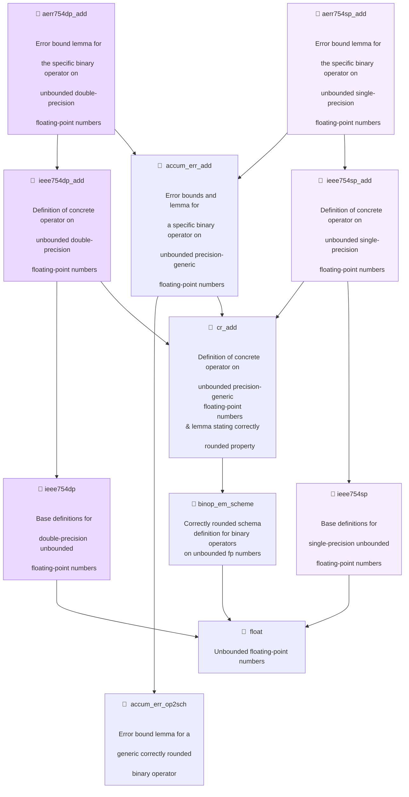

```mermaid
graph TD;
    aerr754dp_op["#128211; aerr754dp_add<br/><br/>
        Error bound lemma for<br/>
        the specific binary operator on<br/>
        unbounded double-precision<br/>
        floating-point numbers"];
    ieee754dp_op["#128211;&nbsp;&nbsp;ieee754dp_add<br/><br/>
        Definition of concrete operator on<br/>
        unbounded double-precision<br/>
        floating-point numbers"];
    ieee754dp["#128211; ieee754dp<br/><br/>
        Base definitions for<br/>
        double-precision unbounded<br/>
        floating-point numbers"];

    aerr754sp_op["#128211; aerr754sp_add<br/><br/>
        Error bound lemma for<br/>
        the specific binary operator on<br/>
        unbounded single-precision<br/>
        floating-point numbers"];
    ieee754sp_op["#128211;&nbsp;&nbsp;ieee754sp_add<br/><br/>
        Definition of concrete operator on<br/>
        unbounded single-precision<br/>
        floating-point numbers"];
    ieee754sp["#128211; ieee754sp<br/><br/>
        Base definitions for<br/>
        single-precision unbounded<br/>
        floating-point numbers"];

    cr["#128211;&nbsp;&nbsp;cr_add<br/><br/>
        Definition of concrete operator on<br/>
        unbounded precision-generic<br/>floating-point
        numbers<br/>& lemma stating correctly<br/>
        rounded property"];
    accumerr["#128211;&nbsp;&nbsp;accum_err_add<br/><br/>
        Error bounds and lemma for<br/>
        a specific binary operator on<br/>
        unbounded precision-generic<br/>
        floating-point numbers<br/>"];
    accum_err_op2sch["#128211;&nbsp;&nbsp;accum_err_op2sch<br/><br/>
        Error bound lemma for a<br/>
        generic correctly rounded<br/>
        binary operator"];
    float["#128211;&nbsp;&nbsp;float<br/><br/>Unbounded floating-point numbers"];


    aerr754sp_op-->accumerr;
    aerr754dp_op-->ieee754dp_op;
    aerr754dp_op-->accumerr;
    accumerr------>accum_err_op2sch;
    aerr754sp_op-->ieee754sp_op;
    accumerr-->cr;
    cr-->binop_em_scheme["#128211; binop_em_scheme<br/><br/>Correctly rounded schema<br/>definition for binary operators<br/>on unbounded fp numbers"];
    binop_em_scheme--->float;
    ieee754sp_op-->cr;
    ieee754dp_op-->ieee754dp;
    ieee754dp_op-->cr;
    ieee754sp_op-->ieee754sp;
    ieee754dp & ieee754sp--->float;


    classDef explain fill:#f7e9c3, stroke:#f7e9c3;
    classDef dp fill:#ebd9ff;
    classDef sp fill:#f6edff;

    class exp_ieee754dp explain;
    class ieee754dp_op,aerr754dp_op,ieee754dp dp;
    class ieee754sp_op,aerr754sp_op,ieee754sp sp;
```