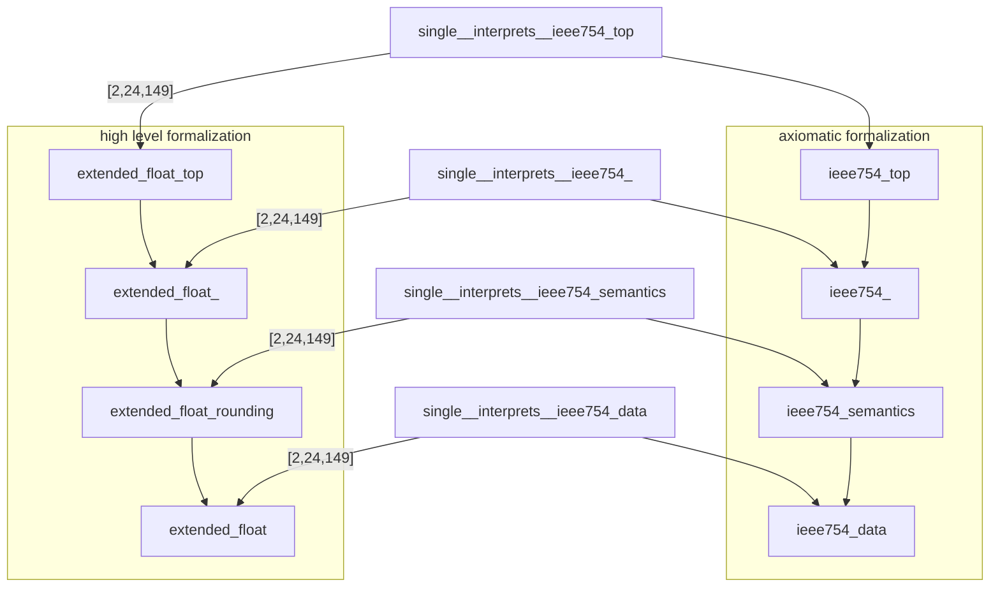

```mermaid
graph TD;

top["extended_float_top"];
atop["ieee754_top"];
op["extended_float_<op>"];
aop["ieee754_<op>"];
rounding["extended_float_rounding"];
sem[ieee754_semantics];
base["extended_float"];
data[ieee754_data];

subgraph high level formalization;
top-->op;
op-->rounding;
rounding-->base;
end

subgraph axiomatic formalization
atop-->aop;
aop-->sem;
sem-->data;
end

sid[single__interprets__ieee754_data];
sid-->|"[2,24,149]"|base;
sid-->data;

sis[single__interprets__ieee754_semantics];
sis-->|"[2,24,149]"|rounding;
sis-->sem;

sio[single__interprets__ieee754_<op>];
sio-->|"[2,24,149]"|op;
sio-->aop;

sit["single__interprets__ieee754_top"];
sit-->|"[2,24,149]"|top;
sit-->atop;
```
