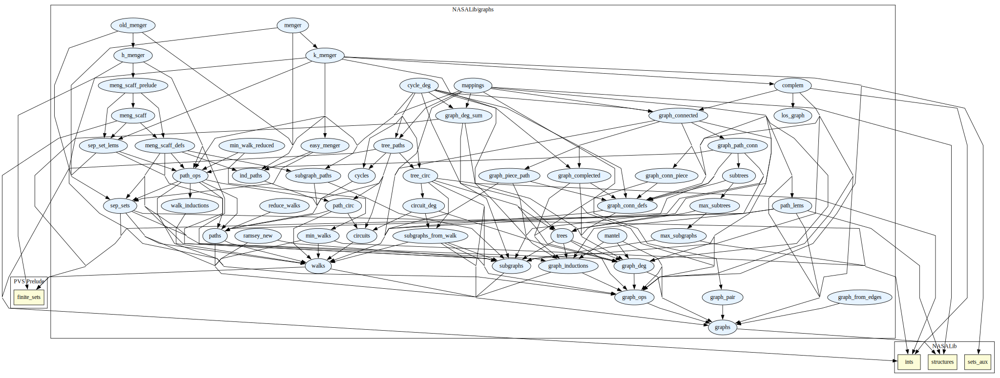

# Graphs

Graph theory: connectedness, walks, trees, Menger's Theorem.

## Highlights

### Major theorems

| Theorem | Location | PVS Name | Contributors |
| --- | --- | --- | --- |
|Matel's Theorem |`graphs@mantel`|`Mantel`| Aaron Dutle |
|Menger's Theorem |`graphs@menger`|`hard_menger`| Jon Sjogren |
|Ramsey's Theorem|`graphs@ramsey`|`ramseys_theorem`| Natarajan Shankar |

# Contributors
* [Ricky Butler](https://shemesh.larc.nasa.gov/people/rwb/), NASA, USA
* Jon Sjogren, Department of Defense, USA
* [Aaron Dutle](http://shemesh.larc.nasa.gov/people/amd), NASA, USA
* [Natarajan Shankar](http://www.csl.sri.com/users/shankar), SRI, USA
* [Mariano Moscato](https://www.nianet.org/directory/research-staff/mariano-moscato/), NIA & NASA, USA
* [Sam Owre](http://www.csl.sri.com/users/owre), SRI, USA

## Maintainer
* [César Muñoz](http://shemesh.larc.nasa.gov/people/cam), NASA, USA

# Bibliography

* Ricky Butler and Jon Sjogren, [A PVS Graph Theory Library](https://ntrs.nasa.gov/citations/19980019858), Technical Memorandum, NASA/TM-1998-206923, February 1998.

# Dependencies

