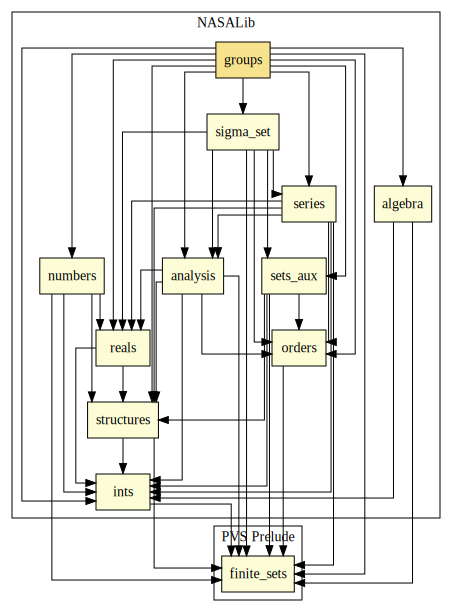

# Algebra (Alternative Formalization)

Alternative formalization of algebraic concepts, such as groups and rings.

Main contributions:
* The following theorem of group theory are formalized:
  - Cauchy Theorem;
  - Isomorphism Theorems;
  - Burside Theorem;
  - Sylow Theorems;
  - New version of the Lagrange Theorem;
  - A variation of the fundamental principle of counting;
  - A variation of the formula for permutation with repetition;
  - Group Action, stabilizer, orbit, normalizer, centralizer, index of a subgroup in a group, and properties;
  - Class Equation;
  - p-groups and properties;
  - Product of Subgroups;
  - New version of the Zn Group, left (right) cosets, factor group and properties.

## Highlights

### Major theorems

| Theorem | Location | PVS Name | Contributors |
| --- | --- | --- | --- |

# Contributors
* André Galdino, Federal University of Goiás, Brazil
* Andreia Avelar Borges, University of Brasilia, Brazil
* Thaynara de Lima, Federal University of Goiás, Brazil
* [Mauricio Ayala-Rincón](http://www.mat.unb.br/~ayala), University of Brasilia, Brazil
* [César Muñoz](http://shemesh.larc.nasa.gov/people/cam), NASA, USA
* [Mariano Moscato](https://www.nianet.org/directory/research-staff/mariano-moscato/), NIA & NASA, USA
* [Sam Owre](http://www.csl.sri.com/users/owre), SRI, USA

## Maintainer
* [César Muñoz](http://shemesh.larc.nasa.gov/people/cam), NASA, USA

# Dependencies

