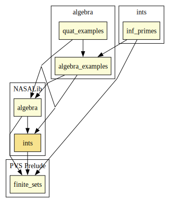

# Integers

Integer division, gcd, mod, prime factorization, min, max.

## Highlights

### Major theorems

| Theorem | Location | PVS Name | Contributors |
| --- | --- | --- | --- |

# Contributors
* Alfons Geser, HTWK Leipzig, Germany
* [Bruno Dutertre](http://www.csl.sri.com/users/bruno), SRI, USA
* [Paul Miner](http://shemesh.larc.nasa.gov/people/psm), NASA, USA
* [Ricky Butler](http://shemesh.larc.nasa.gov/people/rwb), NASA, USA
* [César Muñoz](http://shemesh.larc.nasa.gov/people/cam), NASA, USA
* [Mariano Moscato](https://www.nianet.org/directory/research-staff/mariano-moscato/), NIA & NASA, USA
* [Sam Owre](http://www.csl.sri.com/users/owre), SRI, USA

## Maintainer
* [César Muñoz](http://shemesh.larc.nasa.gov/people/cam), NASA, USA

# Dependencies

