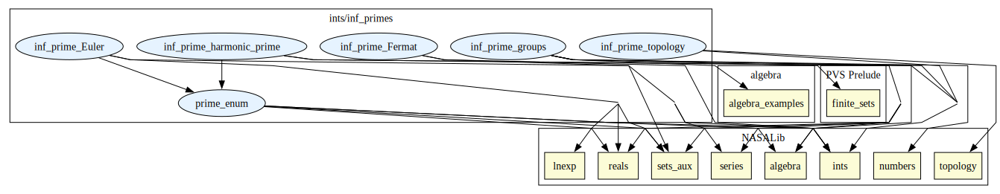

# Infinitude of primes

A collection of proofs of infinitude of primes based on differents branches of mathematics, such as:
number theory; algebra; topology and analysis.

## Highlights

### Major theorems

| Theorem | Location | PVS Name | Contributors |
| --- | --- | --- | --- |
|Fermat number proof |`inf_primes@inf_prime_Fermat`|`primes_is_infinite`| Bruno Ribeiro, Mauricio Ayala-Rincón, Thaynara de Lima|
|Mersenne numbers and group theory proof|`inf_primes@inf_prime_groups`|`primes_is_infinite`|Marcos Brandão, Thaynara de Lima, Bruno Ribeiro, Mauricio Ayala-Rincón |
|Euler product proof |`inf_primes@inf_prime_Euler`|`prime_is_infinite`| Bruno Ribeiro, Mauricio Ayala-Rincón, Thaynara de Lima |
|Fürstenberg proof |`inf_primes@inf_prime_topology`|`prime_set_is_infinite`| Mauricio Ayala-Rincón, Thaynara de Lima, Bruno Ribeiro|
|Prime harmonic series (Erdös) |`inf_primes@inf_prime_harmonic_prime`|`prime_is_infinite`| Bruno Ribeiro, Mauricio Ayala-Rincón, Thaynara de Lima|

# Contributors
* Bruno Berto de Oliveira Ribeiro, University of Brasília, Brazil
* [Mauricio Ayala-Rincón](https://mat.unb.br/~ayala/), University of Brasília, Brazil
* [Thaynara Arielly de Lima](https://thaynaradelima.github.io/), Federal University of Goiás, Brazil
* Marcos Rony Silva Brandão, Federal University of Goiás, Brazil
* [Mariano Moscato](https://marianomoscato.github.io/), AMA @ NASA, USA

## Maintainer
* [César Muñoz](http://shemesh.larc.nasa.gov/people/cam), NASA, USA

# Dependencies

