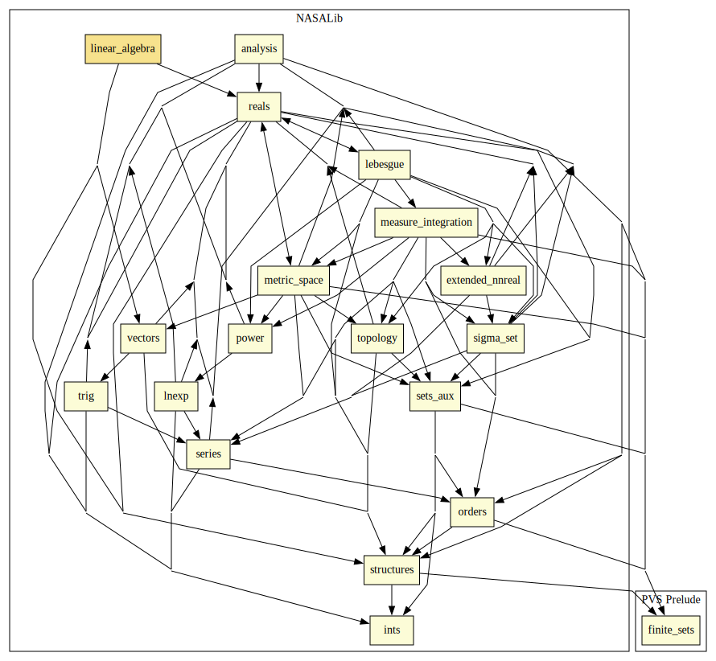

# Linear Algebra

## Highlights

### Major theorems

| Theorem | Location | PVS Name | Contributors |
| --- | --- | --- | --- |

# Contributors
* [Heber Herencia-Zapana](http://www.nianet.org/resources/Research/Research-Staff/Heber-Herencia-Zapana/Heber-Herencia-Zapana.aspx), NIA, USA
* Gilberto Perez, University of La Coruña, Spain
* Pablo Ascariz, University of La Coruña, Spain
* Felicidad Aguado, University of La Coruña, Spain
* [Sam Owre](http://www.csl.sri.com/users/owre), SRI, USA
* [César Muñoz](http://shemesh.larc.nasa.gov/people/cam), NASA, USA
* [Mariano Moscato](https://www.nianet.org/directory/research-staff/mariano-moscato/), NIA & NASA, USA

## Maintainer
* [César Muñoz](http://shemesh.larc.nasa.gov/people/cam), NASA, USA

# Dependencies

