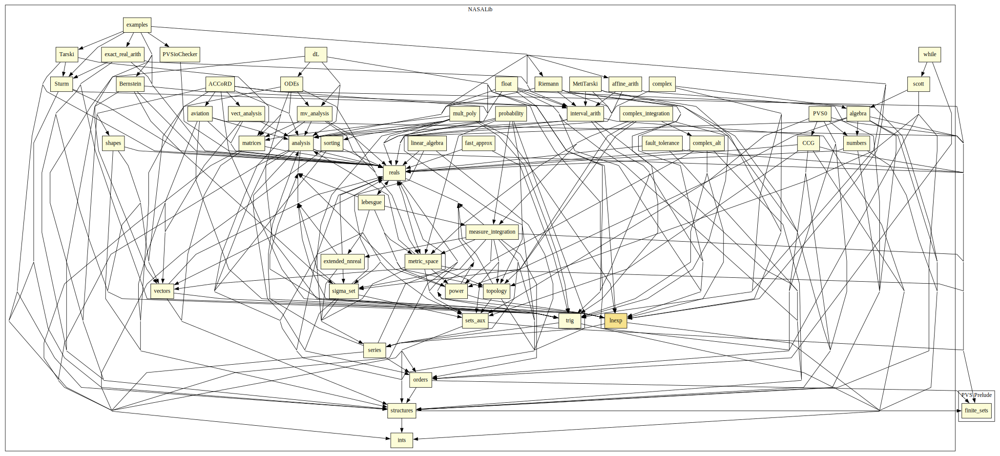

# lnexp

Logarithm, exponential and hyperbolic functions.

## Highlights

### Major theorems

| Theorem | Location | PVS Name | Contributors |
| --- | --- | --- | --- |

# Contributors
* Anthony Narkawicz, NASA, USA
* [David Lester](http://apt.cs.man.ac.uk/people/dlester), Manchester University, UK
* [Ricky Butler](http://shemesh.larc.nasa.gov/people/rwb), NASA, USA
* [César Muñoz](http://shemesh.larc.nasa.gov/people/cam), NASA, USA
* [Mariano Moscato](https://www.nianet.org/directory/research-staff/mariano-moscato/), NIA & NASA, USA

## Maintainer
* [César Muñoz](http://shemesh.larc.nasa.gov/people/cam), NASA, USA

# Dependencies

