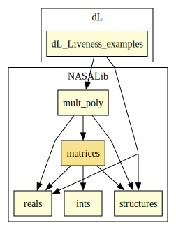

# Matrices

## Highlights

Matrices are represented as list of list of real numbers. Operations
on matrices such as inverse, determinant, etc. are functionally
defined  along with their properties. For a definition of matrices,
where the base type is generic, see [Generic Matrices](generic_matrices/README.md)

# Contributors
* Anthony Narkwicz, formerly NASA, USA
* [César Muñoz](http://shemesh.larc.nasa.gov/people/cam), NASA, USA
* [Sam Owre](http://www.csl.sri.com/users/owre), SRI, USA
* [Mariano Moscato](https://www.nianet.org/directory/research-staff/mariano-moscato/), NIA & NASA, USA

## Maintainer
* [César Muñoz](http://shemesh.larc.nasa.gov/people/cam), NASA, USA

# Dependencies

