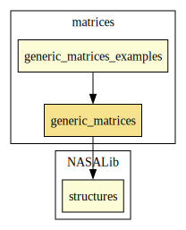

# Generic Matrices

A project to generalize and refactor the vectors and matrices developments within NASALib

## Design goals

NASALib currently has various  implementations of vectors and matrices, none sufficiently general for widespread applications. The team has identified various possible use cases which are currently not supported. Examples include:
* practical neural net computations,
* differential equations in DDL,
* floating point applications,
* the generalization of analysis, and
* spectral graph theory.

In order to facilitate such a broad range of potential applications we need a common container that can be parameterized with various datatypes, and so the specification can not depend on extensive algebraic assumptions. To support this we attempt a modular approach which separates the structural and algebraic properties of vectors and matrices.

We also want the ability to freely index matrices to reduce the need for inductive proofs, while retaining the desirable evaluation properties of list-based implementations. To attain this goal we use a function to record the values of the matrix, but define mappings to and from list representations. Proofs of equivalence allow the two forms to be used interchangeably.

The final primary design goal is the reduction of TCCs. Matrix operations are typically defined in such a way that only matrices of appropriate dimensions can be combined. This leads to extensive TCCs. To minimize this, we chose a "lazy" strategy for which indexing out-of-bounds returns a default value. In constructing matrix and vector operations, this requires the imposition of certain algebraic properties on the default value in order to maintain closure. The result is that we get matrices that can essentially stretch to fill whatever role they are called on to fill.

## Implementation

After extensive testing, the structure chosen for vectors turned out to be similar to the version of finseq in NASALib. The only real difference is that where finseq uses subtyping on the function component, we apply subtyping to the integer recording the length of the vector. This avoids some unpleasantness. The structure for matrices is directly based on that of vectors.

```
generic_vector: TYPE = 

    [# nth:[nat->T],

       length:{i | FORALL (k): k>=i IMPLIES nth(k)=default}

    #]
```

```
gemeric_matrix: TYPE =

    [# ijth:[[nat,nat]->T],

       dimension:{(i,j) | (i=0 IFF j=0) AND

                          (FORALL (k): k>= i IMPLIES FORALL (j1:nat): ijth(k,j1)=default) AND

			  (FORALL (k): k>= j IMPLIES FORALL (i1:nat): ijth(i1,k)=default)}

    #]
```

Each structure possesses a representation by way of a mapping into lists. For a vector v, that list is 

```
(: nth(v,0), nth(v,1), ..., nth(v,length(v)-1) :).
```

A matrix has a similar representation using a list of lists. Care should be taken to make sure that every component list is of the same length -- see the definition of the predicate `rectangular?` in theory `generic_matrix_props.pvs`.

The mapping to and from these representations are defined by eval_vec, eval_mat, abstract_vec, and abstract_mat. These functions are declared as
`CONVERSIONS` allowing us to use the forms interchangeably. We may also use the common shorthand functions eval and abstract.

Please note, the list represetation will only aid in evaluation if the underlying type itself is evaluable.

### Example

Consider the standard vectors and matrices over integers.

```
<PVSio> eval((:1,2,3:)+(:4,5,6:));
==>
(: 5, 7, 9 :)
```

```
<PVSio> eval((:(:1,0,0:),(:0,1,0:),(:0,0,1:):)*(:(:1,2,3:),(:4,5,6:),(:7,8,9:):));
==>
(: (: 1, 2, 3 :), (: 4, 5, 6 :), (: 7, 8, 9 :) :)
```

We are not strictly constrained by dimensions. Vectors and matrices can "stretch" to fit the situation by using the default values that exist outside of the stated bounds. This eliminates a major source of tcc's.

```
<PVSio> (:1,1:)*(:1,1,1,1:);
==>
2

<PVSio> eval((:(:1,2:),(:3,4:):)+(:(:1,1,1,1:),(:1,1,1,1:),(:1,1,1,1:),(:1,1,1,1:):));
==>
(: (: 2, 3, 1, 1 :), (: 4, 5, 1, 1 :), (: 1, 1, 1, 1 :), (: 1, 1, 1, 1 :) :)
```

Note that the vector product does not need to be wrapped with eval, but for consistency we may allow it later.

## Operations

For maximum generality, operations are defined with as few assumptions as possible. At the lowest level we have vector and matrix operators that can be defined without considering any binary operators on the underlying type with special properties.

* `map(f,v)` -- apply `f` to each `v(i)`
* `map(f,M)` -- apply `f` to each M(i,j)
* `expand(o)(u,v)` -- create a matrix `M` s.t. `M(i,j) = u(i) o v(j)`
* `collapse(o)(v)` -- `v(0) o (v(1) o (...))`
* `transpose(M)` -- `M^t(i,j) = M(j,i)`

Scalar operations are defined relative an action of a second type `S` over the type underlying the generic structures. To maintain closure the default value must be an absorbing element for the action.

* `scalar(o)(s,v)` -- apply `lambda(x):(s o x)` pointwise to `v`
* `scalar(o)(s,M)` -- apply `lambda(x):(s o x)` pointwise to `M`

The pointwise application of a binary operation requires that the default value be idempotent relative the operation.

* `pointwise(o)(u,v)` -- the `i`-th element of the result is `u(i) o v(i)`
* `pointwise(o)(M,N)` -- the `i`-jth element of the result is `M(i,j) o N(i,j)`

Traditional vector and matrix products are defined as derived operations.

* `gvec_product(+,*)(u,v) = collapse(+)(pointwise(*)(u,v))` -- default must be idempotent relative both `+` and `*`
* `gmat_product(+,*)(M,N)` -- the `i`-jth element of the result is `gvec_product(+,*)(row(M,i),column(N,j))`, default must be idempotent relative `+` and an absorbing element relative `*`

The basic operations can aid in the construction of similar derived operations. For instance, we can relax the absorbing element requirement in
`gmat_product` by constructing a recursive analogue to matrix multiplication using the expand operator

```
expand(*)(column(M,0),row(N,0)) + expand(*)(column(M,1),row(N,0)) + ...
```

For most applications the matrix algebra theory will streamline instantiations and handle the construction of the most common operations. The more basic operations above are intended to be more of a "power user" feature to aid in the construction of novel applications.

### Example

In the theory [`example_strings.pvs`](../generic_matrices_examples/example_strings.pvs) we create vectors and matrices of strings using concatenation as our pointwise operation. Where absorption is needed, we use a modified concatenation where the empty string acts as an absorbing element. Using the natural numbers as scalars, scalar multiplication duplicates strings (i.e., 2*"test" = "testtest").

```
<PVSio> eval((:"1","2","3":)+(:"4","5","6":));
==>
(: "14", "25", "36" :)

<PVSio> eval((:(:"1","0","0":),(:"0","1","0":),(:"0","0","1":):)*(:(:"1","2","3":),(:"4","5","6":),(:"7","8","9":):));
==>
(: (: "110407", "120508", "130609" :), (: "011407", "021508", "031609" :),
   (: "010417", "020518", "030619" :) :)

<PVSio> eval((:(:" ","","":),(:""," ","":),(:"",""," ":):)*(:(:"1","2","3":),(:"4","5","6":),(:"7","8","9":):));
==>
(: (: " 1", " 2", " 3" :), (: " 4", " 5", " 6" :), (: " 7", " 8", " 9" :) :)

<PVSio> (:"1","1":)*(:"1","1","1","1":);
==>
"1111"

<PVSio> eval((:(:"1","2":),(:"3","4":):)+(:(:"1","1","1","1":),(:"1","1","1","1":),(:"1","1","1","1":),(:"1","1","1","1":):));
==>
(: (: "11", "21", "1", "1" :), (: "31", "41", "1", "1" :),
   (: "1", "1", "1", "1" :), (: "1", "1", "1", "1" :) :)

<PVSio> eval(3*(:(:"a","b":),(:"c","d":):));
==>
(: (: "aaa", "bbb" :), (: "ccc", "ddd" :) :)
```


# Contributors
* John Siratt, NASA, USA

## Maintainer
* John Siratt, NASA USA
* [César Muñoz](http://shemesh.larc.nasa.gov/people/cam), NASA, USA

# Dependencies

