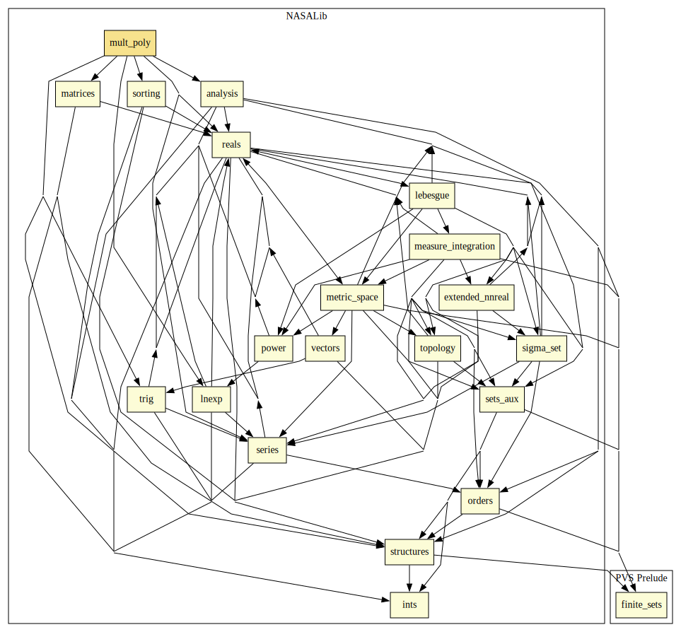
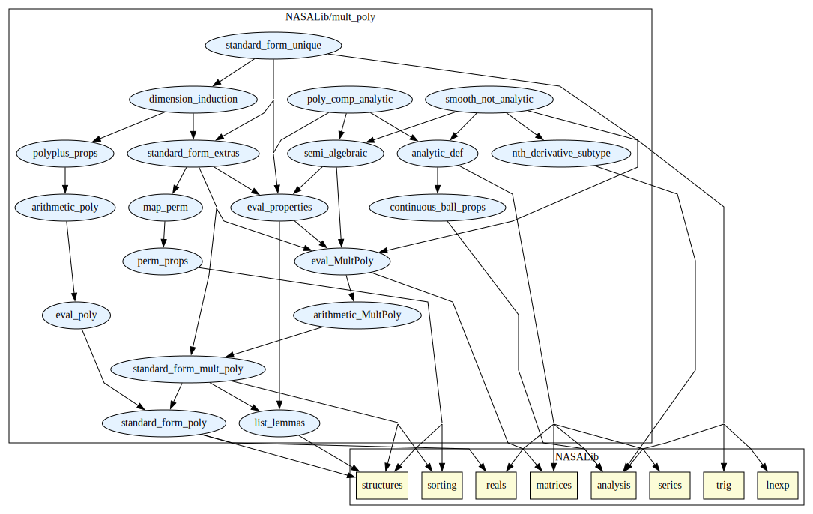

# Multivariate Polynomials

This library contains a formalization of multivariate polynomials
and semi-algebriac sets. For full descriptioon see: "Formal Verification of the  Interaction Between Semi-Algebraic Sets and Real Analytic Functions." 

## External Dependencies

## Internal Summary

| Theory Name | Description |
|---|---|
| [`hp_def`](hp_def.pvs) | Preliminary definitions for hybrid programs. |
| [`standard_form_poly`](standard_form_poly.pvs) | Establish single variate polynomial as list of real numbers, with standard form. |
  | [`list_lemmas`](list_lemmas.pvs) | Facts about lists that are needed for subsequent theories. |
 | [`perm_props`](perm_props.pvs) | Facts about permutations of lists that are needed for subsequent theories. |
 | [`map_perm`](map_perm.pvs) | Show that permutation lifts through maps. Needed for subsequent theories. |
  | [`continuous_ball_props`](continuous_ball_props.pvs) | Basic properties of continuity, needed for later results related to analytic functions. |
  | [`standard_form_mult_poly`](standard_form_mult_poly.pvs)| Defines Multivariate Polynomials and their standard form, with properties of standard form.| 
  | [`arithmetic_MultPoly`](arithmetic_MultPoly.pvs) | Defines arithmetic operations for Multivariate Polynomials with useful properties. |
  | [`eval_MultPoly`](eval_MultPoly.pvs) |This is defining evaluations of a Multivariate Polynomial with useful properties.|
  | [`eval_properties`](eval_properties.pvs) | Additional properties of evaluation of multi-variate polynomials. These are needed to show the uniqueness of standard form up to full evaluation. |
  | [`standard_form_extras`](standard_form_extras.pvs) | This is extra properties of standard form, to help show uniqueness. |
  | [`dimension_induction`](dimension_induction.pvs) | This theory implements a reduction in dimension of polynomials to a univariate polynomial with multivariate polynomial coefficients. It is used in the proof that standard form is unique. |
  | [`standard_form_unique`](standard_form_unique.pvs) | Proves that the standard form of a polynomial is unique for all polynomials the evaluation is the same for. |
  | [`semi_algebraic`](semi_algebraic.pvs) | This is defining evaluations of a Multivariate Polynomial with useful properties.|
  | [`analytic_def`](analytic_def.pvs) | Basic definition and properties of real analytic functions.|
  | [`smooth_not_analytic`](smooth_not_analytic.pvs)| This introduces a function that is smooth and not analytic, and shows that it does not interact with an SA set in a `nice' way, like real analytic functions do. |
  | [`poly_comp_analytic`](poly_comp_analytic.pvs)| The composition of a real analytic function with a multi-variate polynomial is still real analytic. Also shows the favorable properties of real analytic functions interacting with semi-algebraic sets. |

# Contributors
* Lauren White, NASA, USA 
* J Tanner Slagel, NASA, USA
* [Aaron Dutle](http://shemesh.larc.nasa.gov/people/amd), NASA, USA

## Maintainer
* Lauren White, NASA, USA, <lauren.m.white@nasa.gov>

