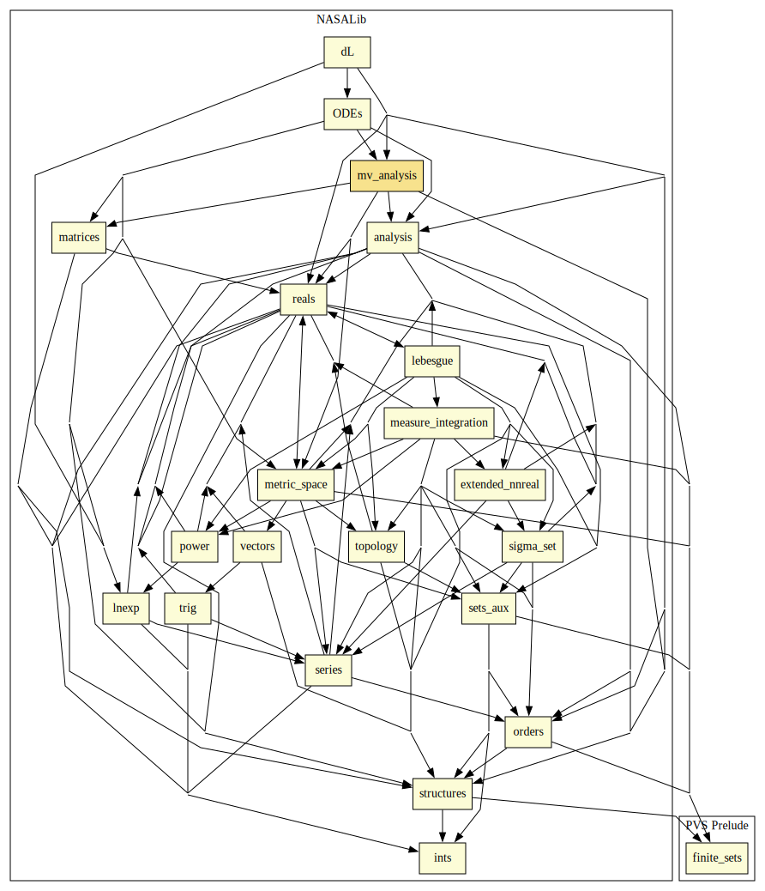
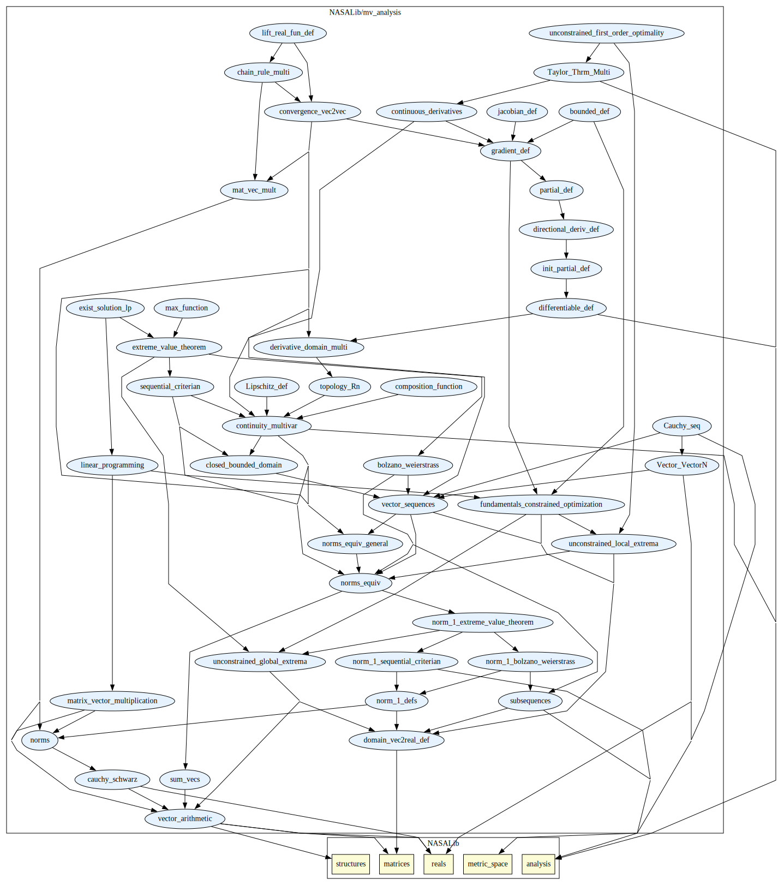

# Multivariate Analysis

Real analysis, norms, limits, continuity, derivatives, optimization

## Highlights

### Major theorems

| Theorem | Location | PVS Name | Contributors |
| --- | --- | --- | --- |
|Cauchy Schqarz Inequality  |`mv_analysis@cauchy_schwarz`|`cauchy_schwarz`| J Tanner Slagel |
|Equivalence of Norms |`mv_analysis@norms_equiv`|`equiv_norm`| J Tanner Slagel |
|Sequential Criterian |`mv_analysis@sequential_criterian`|`sequential_criterian1`| J Tanner Slagel |
|Bolzano Weierstass Theorem |`mv_analysis@bolzano_weierstrass`|`bolzano_weier`| J Tanner Slagel |
|Extreme Value Theorem |`mv_analysis@extreme_value_theorem`|`extreme_value`| J Tanner Slagel |
|Equivalence between Fréchet Derivative and Gradient|`mv_analysis@gradient_def`|`der_f_is_grad`| J Tanner Slagel |
|Taylor's Theorem (n=1 case) |`mv_analysis@Taylor_Thrm_Multi`|`Taylors_Thm`| J Tanner Slagel |
|First Order Necessary Conditions for Optimality |`mv_analysis@unconstrained_first_order_optimality`|`first_order_nec`| J Tanner Slagel |
|Existance of Solution to Linear Program |`mv_analysis@exist_solution_lp`|`existance_np_1`| J Tanner Slagel |
|Multivaraite Chain Rule |`mv_analysis@hcain_rule_multi`|`chain_rule_multi_der_is_subdom`| J Tanner Slagel |

# Contributors
* J Tanner Slagel, NASA, USA
* [Aaron Dutle](http://shemesh.larc.nasa.gov/people/amd), NASA, USA

## Maintainer
* J Tanner Slagel, NASA, USA, <j.tanner.slagel@nasa.gov>

# Dependencies

