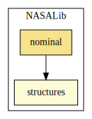
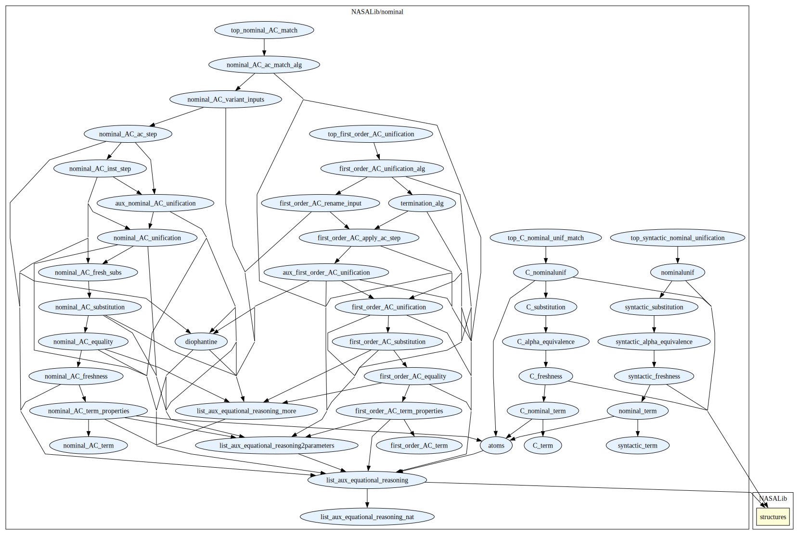

# Nominal

Nominal systems are an alternative approach for the treatment of variables in computational systems. In the nominal approach variable bindings are represented using techniques that are close to first-order logical techniques, instead of using a higher-order metalanguage. Functional nominal computation can be modelled through nominal rewriting, in which α-equivalence, nominal matching and nominal unification play an important role. 

This library contains formalisations of unification and matching algorithms modulo some equational theories.
Namely:
 - A nominal syntactic unification algorithm.  
 - A nominal C-unification algorithm with a parameter for "protected variables". By adding a parameter for
“protected variables” that cannot be instantiated during the execution, it also enables nominal C-matching
and nominal C-equality checking.
 - A first-order AC-unification algorithm.
 - A nominal AC-matching algorithm. It was obtained by enriching the
first-order AC-unification formalisation providing structures and mechanisms to
deal with the combinatorial aspects of nominal atoms, permutations and
abstractions. By using the general treatment of protected variables we also
obtained a verified nominal AC-equality checker as a byproduct.

## Highlights
### Major Theorems - Syntactic Nominal Unification
| Theorem   | Location | PVS Theorem name |  
| ----      | ----     | ----     |  
| Soundness of Nominal Syntactic Unification  | `syntactic_nominal_unif.pvs` | `unify_sound` |  
| Completeness of Nominal Syntactic Unification | `syntactic_nominal_unif.pvs` | `unify_complete` |  

### Major Theorems - Nominal C-Unification Generalised With Protected Variables 
| Theorem | Location | PVS Theorem name |  
| ----      | ----     | ----     |  
| Soundness of Nominal Syntactic Unification | `C_nominal_unif.pvs` | `C_unify_sound` |  
| Completeness of Nominal Syntactic Unification | `C_nominal_unif.pvs` | `C_unify_complete` | 

### Major Theorems - First-Order AC-Unification
| Theorem | Location | PVS Theorem name |  
| ----      | ----     | ----     |  
| Soundness of First-Order AC-Unification | `first_order_AC_unification_alg.pvs` | `unify_alg_correct_cor` |  
| Completeness of First-Order AC-Unification | `first_order_AC_unification_alg.pvs` | `unify_alg_complete_cor2` | 

### Major Theorems - Nominal AC-Matching
| Theorem | Location | PVS Theorem name |  
| ----      | ----     | ----     |  
| Soundness of Nominal AC-Matching | `nominal_AC_ac_match_alg.pvs` | `ac_match_sound` |  
| Completeness of Nominal AC-Matching | `nominal_AC_ac_match_alg.pvs` | `ac_match_completeness_match` | 

## Contributors
* [Mauricio Ayala-Rincón](https://www.mat.unb.br/ayala/), University of Brasília, Brazil
* [Maribel Fernández](https://www.kcl.ac.uk/people/maribel-fernandez), King's College London, UK
* [Gabriel Ferreira Silva](https://gabriel951.github.io/), University of Brasília, Brazil
* [Temur Kutsia](https://www3.risc.jku.at/people/tkutsia/), Johannes Kepler University, Austria
* Ana Cristina Rocha Oliveira, University of Brasília, Brazil
* [Daniele Nantes-Sobrinho](https://www.mat.unb.br/dnantes/), University of Brasília, Brazil
* Washington Luis Ribeiro de Carvalho Segundo, University of Brasília, Brazil

### Mantainer
* [Gabriel Ferreira Silva](https://gabriel951.github.io/)

## Dependencies

* Library level

* Theory level

## References

[1] Ayala-Rincón, M., Fernández, M., & Rocha-Oliveira, A.C. (2016). [Completeness in PVS of a Nominal Unification Algorithm](https://doi.org/10.1016/j.entcs.2016.06.005), in Proceedings of the Tenth Workshop on Logical and Semantic Frameworks, with Applications (LSFA 2015), Electronic Notes in Theoretical Computer Science, Volume 323, 2016, Pages 57-74, ISSN 1571-0661.

[2] Ayala-Rincón, M., De Carvalho-Segundo, W., Fernández, M., Silva, G., & Nantes-Sobrinho, D. (2021). [Formalising nominal C-unification generalised with protected variables](https://doi.org/10.1017/S0960129521000050). Mathematical Structures in Computer Science, 31(3), 286-311. .

[3] Ayala-Rincón, M., Fernández, M., Silva, G.F., & Nantes-Sobrinho, D. A. (2022). [Certified Algorithm for AC-Unification](https://doi.org/10.4230/LIPIcs.FSCD.2022.8). In Proc. of the 7th International Conference on Formal Structures for Computation and Deduction (FSCD 2022). Leibniz International Proceedings in Informatics (LIPIcs), Volume 228, pp. 8:1-8:21, Schloss Dagstuhl - Leibniz-Zentrum für Informatik.

[4] Ayala-Rincón, M., Fernández, M., Silva, G.F., Kutsia, T., Nantes-Sobrinho, D. (2023). [Nominal AC-Matching](https://doi.org/10.1007/978-3-031-42753-4_4). In: Dubois, C., Kerber, M. (eds) Intelligent Computer Mathematics. CICM 2023. Lecture Notes in Computer Science, vol 14101. Springer, Cham.
