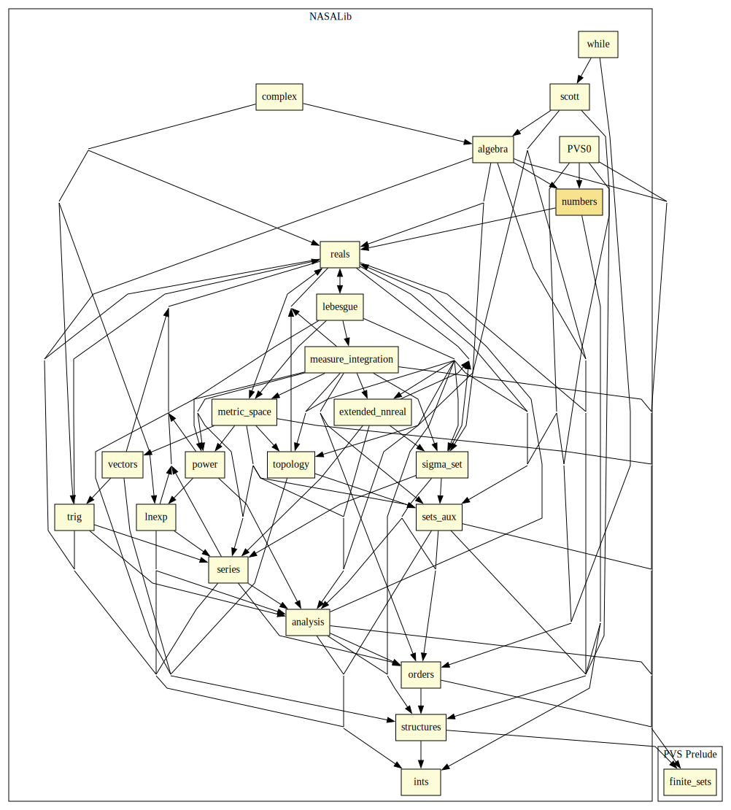

# Numbers

Results on Numbers Theory, including:
* factorization into primes,
* factorization is unique,
* the set of primes has infinite cardinality,
* sqrt(2) is irrational,
* every prime `p` with `mod(p,4)=1` is a sum of two squares,
* every prime `p` satisfies `mod(a^p,p)=a` for all `a < p`,
* every natural number is a sum of four squares,
* list of natural numbers are enumerable,
* bijection between tuples of naturals and naturals.

## Highlights

### Major theorems

| Theorem | Location | PVS Name | Contributors |
| --- | --- | --- | --- |
|Infinitude of Primes |`numbers@infinite_primes`|`primes_infinite`|Ricky Butler |
|Fundamental Theorem of Arithmetic  |`numbers@unique_factorization`|`Fundamental_Theorem_Arithmetic`| Ricky Butler|

# Contributors
* Alfons Geser, HTWK Leipzig, Germany
* Anthony Narkawicz, NASA, USA
* [Ricky Butler](https://shemesh.larc.nasa.gov/people/rwb/), NASA, USA
* [César Muñoz](http://shemesh.larc.nasa.gov/people/cam), NASA, USA
* Thiago Mendonça, University of Brasilia, Brazil
* [Sam Owre](http://www.csl.sri.com/users/owre), SRI, USA
* [Mariano Moscato](https://www.nianet.org/directory/research-staff/mariano-moscato/), NIA & NASA, USA

## Maintainer
* [César Muñoz](http://shemesh.larc.nasa.gov/people/cam), NASA, USA

# Dependencies

