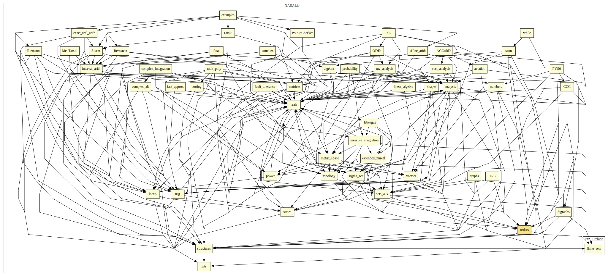

# Orders

This formalization includes properties and definitions about orders, such as abstract orders, Lattices, fix points, etc.

## Highlights

### Major theorems

| Theorem | Location | PVS Name | Contributors |
| --- | --- | --- | --- |
|Schroeder-Bernstein Theorem |`orders@set_antinsymmetric`|`inj_inj_bij`| Jerry James |

# Contributors
* Alfons Geser, HTWK Leipzig, Germany
* [Bruno Dutertre](http://www.csl.sri.com/users/bruno), SRI, USA
* Jerry James, Utah State University, USA
* [César Muñoz](http://shemesh.larc.nasa.gov/people/cam), NASA, USA
* [Mariano Moscato](https://www.nianet.org/directory/research-staff/mariano-moscato/), NIA & NASA, USA
* Anthony Narkawicz, NASA, USA
* [Marco A. Feliú](https://www.nianet.org/directory/research-staff/marco-feliu/), NIA & NASA, USA
* [Sam Owre](http://www.csl.sri.com/users/owre), SRI, USA

## Maintainer
* [César Muñoz](http://shemesh.larc.nasa.gov/people/cam), NASA, USA

# Dependencies

