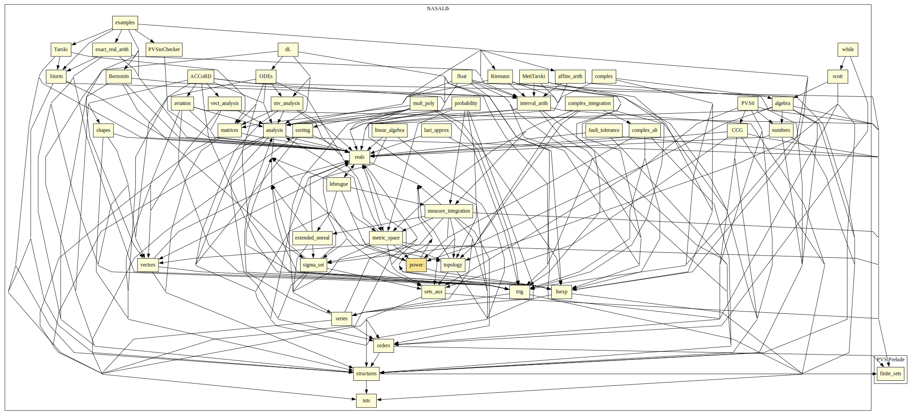

# Power

This library provides Roots, Powers and Generalized Logarithms.
Hooks are provided so that the power function along with root and log can be shown to be continuous (over suitable domains), but no continuity libraries have been used to construct this library, meaning that it is built directly onto the standard SRI prelude.
Features include:
* By importing `root`, you can have statements like: `root(8,3) = 2`
* By importing `real_expt`, you can have statements like: `8^(1/3) = 2`
* BY importing `log`, you can have statements like: `log(2)(8) = 3` meaning `ln(8)/ln(2)`

## Highlights

### Major theorems

| Theorem | Location | PVS Name | Contributors |
| --- | --- | --- | --- |

# Contributors
* [David Lester](http://apt.cs.man.ac.uk/people/dlester), Manchester University, UK
* [César Muñoz](http://shemesh.larc.nasa.gov/people/cam), NASA, USA
* [Sam Owre](http://www.csl.sri.com/users/owre), SRI, USA
* [Mariano Moscato](https://www.nianet.org/directory/research-staff/mariano-moscato/), NIA & NASA, USA

## Maintainer
* [César Muñoz](http://shemesh.larc.nasa.gov/people/cam), NASA, USA

# Dependencies

