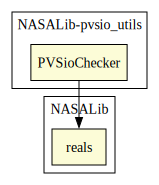
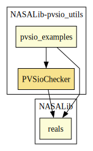

# PVSioChecker

This library provides functionalities to run differential testing with
PVSio. For an example, see [PVSChecker Example](../pvsio_examples/prime_factorization_checker.pvs).

## Highlights

# Contributors
* [César Muñoz](http://shemesh.larc.nasa.gov/people/cam), NASA, USA
* Mariano Moscato, AMA@NASA LaRC, USA

## Maintainer
* [César Muñoz](http://shemesh.larc.nasa.gov/people/cam), NASA, USA

# Dependencies

