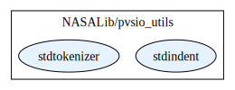
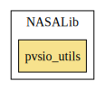

# pvsio_utils

This library extends PVSio, a PVS standard library for animation of
PVS specifications. It provides the following utilities.

|---|---|
|  [pvsio_utils/PVSioChecker](./PVSioChecker/README.md) | A PVSio library for differential testing |
| [pvsio_utils/PVSioCSV](./PVSioCSV/README.md) | A PVSio library for reading and writing Comma Separated Value files |
| [pvsio_utils/PVSioKeyVal](./PVSioKeyVal/README.md) | A PVSio simple key/value store |
|---|---|

## Highlights

# Contributors
* [César Muñoz](http://shemesh.larc.nasa.gov/people/cam), NASA, USA
* [Mariano Moscato](https://www.nianet.org/directory/research-staff/mariano-moscato/), NIA & NASA, USA
* [Sam Owre](http://www.csl.sri.com/users/owre), SRI, USA

## Maintainer
* [César Muñoz](http://shemesh.larc.nasa.gov/people/cam), NASA, USA

# Dependencies

