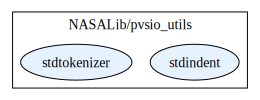

# pvsio_utils

This library includes several extensions to PVSio, the PVS standard library for animation of
PVS specifications. It provides the following utilities.

| Library  | Description |
|---|---|
| [PVSioRegex](./PVSioRegex/README.md) | An efficient implemenation of regular expressions |
| [PVSioPEG](./PVSioPEG/README.md) | A practical implemenation of Parsing Expression Grammars (PEG) |
| [PVSioIndent](./PVSioIndent/README.md) | A set of utilities for generating indented text |
| [PVSioChecker](./PVSioChecker/README.md) | A PVSio library for differential testing |
| [PVSioCSV](./PVSioCSV/README.md) | A PVSio library for reading and writing Comma Separated Value files |
| [PVSioHTML](./PVSioHTML/README.md) | A PVSio library for writing HTML files |
| [PVSioIndent](./PVSioIndent/README.md) | A PVSio library for producing indented text |
| [PVSioKeyVal](./PVSioKeyVal/README.md) | A PVSio simple key/value store |

## Highlights

# Contributors
* [César Muñoz](http://shemesh.larc.nasa.gov/people/cam), NASA, USA
* Mariano Moscato, AMA@NASA LaRC, USA

## Maintainer
* [César Muñoz](http://shemesh.larc.nasa.gov/people/cam), NASA, USA
