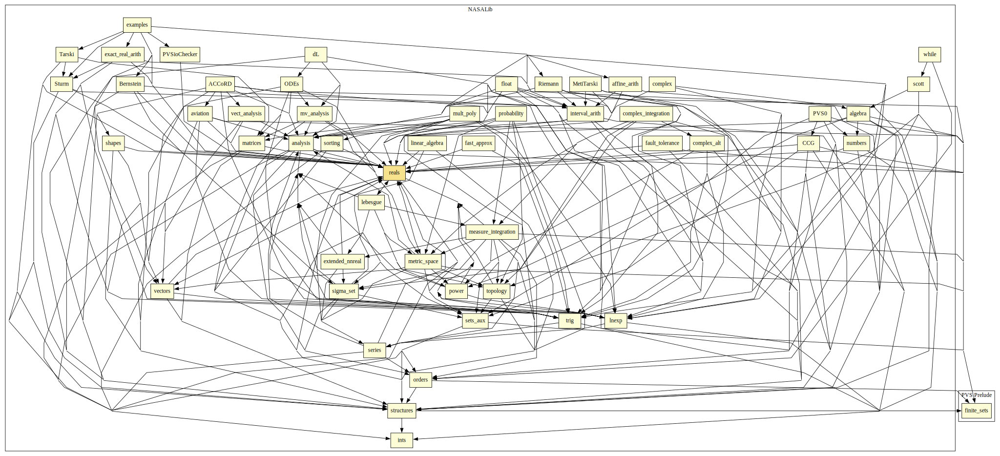

# Real Numbers

Elementary properties of and operations over real numbers.
Main contributions:
* a family of summation functions over functions `[T FROM int -> real]` (see `sigma.pvs`)
* properties on min,max (see `min_max.pvs`)
* additional properties of abs (see `abs_lems.pvs`)
* defines product over functions [int -> real] (see `product_real.pvs`)
* defines sup, inf, max, min (see `bounded_reals.pvs`)
* properties of sup, inf, max, min (see `real_sets.pvs`)
* adding, subtracting, etc on functions (see `real_fun_ops.pvs`)
* increasing?, decreasing?, etc on functions (see `real_fun_preds.pvs`) and properties (see `real_fun_props.pvs`)
* additional properties of exponent (see `exponent_props.pvs`)
* properties of square root (see `sqrt.pvs` and `sqrt_rew.pvs`)
* definition of newton and bisection methods for computing square roots (see `sqrt_newton` and `sqrt_bisect` in `sqrt_approx.pvs`)
* square function and properties (see `sq.pvs` and `sq_rew.pvs`)
* properties of sign function (see `sign.pvs`)
* properties of sign3 function (see `sign3.pvs`)
* solution of quadratic equations (see `quadratic.pvs`)
* a better solution of quadratic equations for 2b (see `quadratic_2b.pvs`)
* minimum and Maximum of quadratic equations (see `quad_minmax.pvs`)
* binomial coefficient (see `binomial.pvs`)
* polynomials (see `polynomials.pvs`)

## Highlights

### Major theorems

| Theorem | Location | PVS Name | Contributors |
| --- | --- | --- | --- |

# Contributors
* Anthony Narkawicz, NASA, USA
* [Ben Di Vito](http://shemesh.larc.nasa.gov/people/bld), NASA, USA
* [César Muñoz](http://shemesh.larc.nasa.gov/people/cam), NASA, USA
* [Paul Miner](http://shemesh.larc.nasa.gov/people/psm), NASA, USA
* [Ricky Butler](http://shemesh.larc.nasa.gov/people/rwb), NASA, USA
* Amy Isvik, Wartburg College, USA
* [Mariano Moscato](https://www.nianet.org/directory/research-staff/mariano-moscato/), NIA & NASA, USA
* [Marco A. Feliú](https://www.nianet.org/directory/research-staff/marco-feliu/), NIA & NASA, USA
* [Sam Owre](http://www.csl.sri.com/users/owre), SRI, USA

## Maintainer
* [César Muñoz](http://shemesh.larc.nasa.gov/people/cam), NASA, USA

# Dependencies

