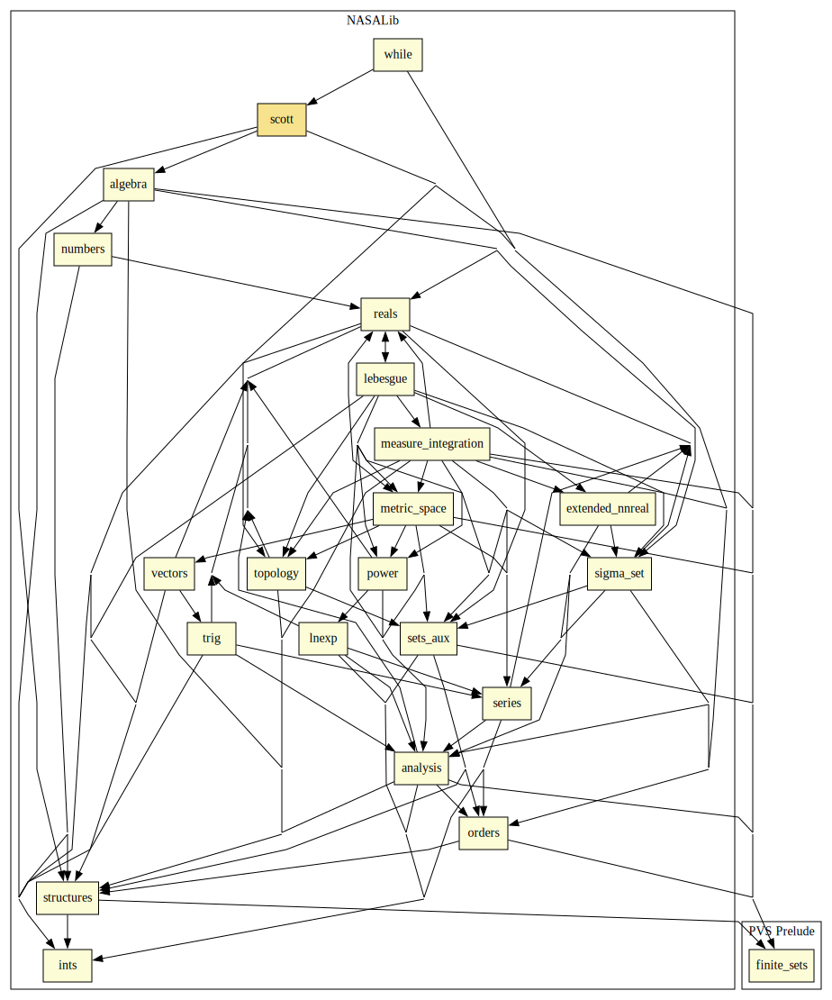

# Scott Topology

This library defines the Scott Topology, and shows that continuous functions are increasing and _lub-preserving_; and -- under point-wise ordering -- also form a Scott Topology.
The main reason Computer Scientists are interested is that it constitutes a general foundation on which to build the fix point theory needed for the semantics of loops and recursive functions.

This library is mainly based on BA Davey and HA Priestly "Introduction to Lattices and Orders", CUP, 1990.

## Highlights

### Major theorems

| Theorem | Location | PVS Name | Contributors |
| --- | --- | --- | --- |

# Contributors
* [David Lester](http://apt.cs.man.ac.uk/people/dlester), Manchester University, UK
* [César Muñoz](http://shemesh.larc.nasa.gov/people/cam), NASA, USA
* [Mariano Moscato](https://www.nianet.org/directory/research-staff/mariano-moscato/), NIA & NASA, USA
* [Sam Owre](http://www.csl.sri.com/users/owre), SRI, USA

## Maintainer
* [César Muñoz](http://shemesh.larc.nasa.gov/people/cam), NASA, USA

# Dependencies

