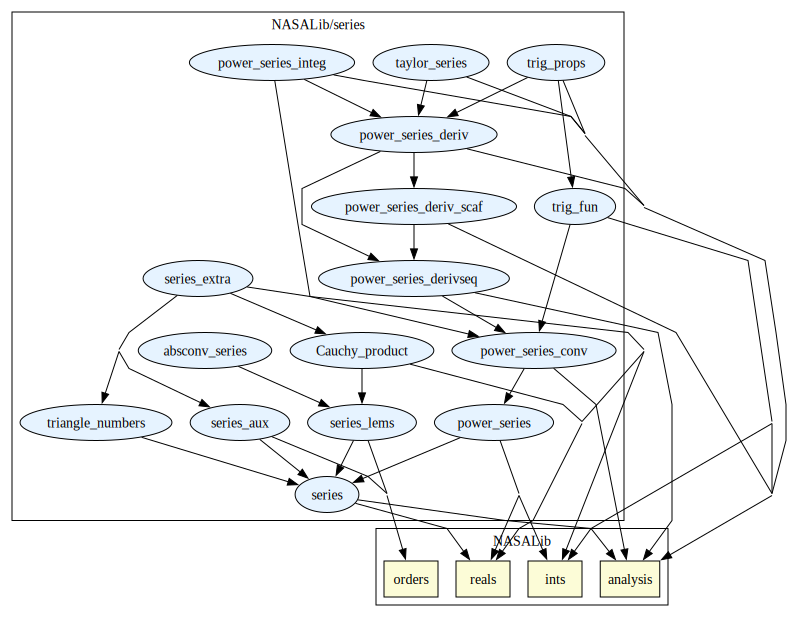
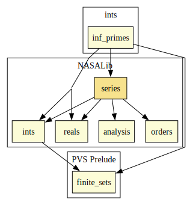

# Series

Power series, comparison test, ratio test, Taylor's theorem.

## Highlights

### Major theorems

| Theorem | Location | PVS Name | Contributors |
| --- | --- | --- | --- |
|Derivative of a Power Series |`series@power_series_deriv`|`powerseries_deriv`|Ricky Butler |
|Integral of a Power Series |`series@power_series_integ`|`integral_powerseries`|Ricky Butler |
|Sum of a Geometric Series |`series@series`|`geometric_sum`| Ricky Butler |
|Cauchy product formula |`series@Cauchy_product`|`Cauchy_product`| Bruno Ribeiro |

# Contributors
* Anthony Narkawicz, NASA, USA
* [David Lester](http://apt.cs.man.ac.uk/people/dlester), Manchester University, UK
* [Ricky Butler](http://shemesh.larc.nasa.gov/people/rwb), NASA, USA
* [César Muñoz](http://shemesh.larc.nasa.gov/people/cam), NASA, USA
* [Mariano Moscato](https://marianomoscato.github.io/), AMA @ NASA, USA
* [Sam Owre](http://www.csl.sri.com/users/owre), SRI, USA
* Bruno Berto de Oliveira Ribeiro, University of Brasilia, Brazil
## Maintainer
* [César Muñoz](http://shemesh.larc.nasa.gov/people/cam), NASA, USA

# Dependencies

